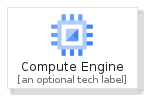
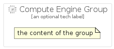

# ComputeEngine


```text
gcp/Item/ComputeEngine
```

```text
include('gcp/Item/ComputeEngine')
```


| Illustration | ComputeEngine | ComputeEngineCard | ComputeEngineGroup |
| :---: | :---: | :---: | :---: |
|  |  |  |  |


## ComputeEngine

### Load remotely
```plantuml
@startuml
' configures the library
!global $LIB_BASE_LOCATION="https://raw.githubusercontent.com/tmorin/plantuml-libs/master/distribution"

' loads the library's bootstrap
!include $LIB_BASE_LOCATION/bootstrap.puml

' loads the package bootstrap
include('gcp/bootstrap')

' loads the Item which embeds the element ComputeEngine
include('gcp/Item/ComputeEngine')

' renders the element
ComputeEngine('ComputeEngine', 'Compute Engine', 'an optional tech label', 'an optional description')
@enduml
```

### Load locally
```plantuml
@startuml
' configures the library
!global $INCLUSION_MODE="local"
!global $LIB_BASE_LOCATION="../.."

' loads the library's bootstrap
!include $LIB_BASE_LOCATION/bootstrap.puml

' loads the package bootstrap
include('gcp/bootstrap')

' loads the Item which embeds the element ComputeEngine
include('gcp/Item/ComputeEngine')

' renders the element
ComputeEngine('ComputeEngine', 'Compute Engine', 'an optional tech label', 'an optional description')
@enduml
```

## ComputeEngineCard

### Load remotely
```plantuml
@startuml
' configures the library
!global $LIB_BASE_LOCATION="https://raw.githubusercontent.com/tmorin/plantuml-libs/master/distribution"

' loads the library's bootstrap
!include $LIB_BASE_LOCATION/bootstrap.puml

' loads the package bootstrap
include('gcp/bootstrap')

' loads the Item which embeds the element ComputeEngineCard
include('gcp/Item/ComputeEngine')

' renders the element
ComputeEngineCard('ComputeEngineCard', 'Compute Engine Card', 'an optional description')
@enduml
```

### Load locally
```plantuml
@startuml
' configures the library
!global $INCLUSION_MODE="local"
!global $LIB_BASE_LOCATION="../.."

' loads the library's bootstrap
!include $LIB_BASE_LOCATION/bootstrap.puml

' loads the package bootstrap
include('gcp/bootstrap')

' loads the Item which embeds the element ComputeEngineCard
include('gcp/Item/ComputeEngine')

' renders the element
ComputeEngineCard('ComputeEngineCard', 'Compute Engine Card', 'an optional description')
@enduml
```

## ComputeEngineGroup

### Load remotely
```plantuml
@startuml
' configures the library
!global $LIB_BASE_LOCATION="https://raw.githubusercontent.com/tmorin/plantuml-libs/master/distribution"

' loads the library's bootstrap
!include $LIB_BASE_LOCATION/bootstrap.puml

' loads the package bootstrap
include('gcp/bootstrap')

' loads the Item which embeds the element ComputeEngineGroup
include('gcp/Item/ComputeEngine')

' renders the element
ComputeEngineGroup('ComputeEngineGroup', 'Compute Engine Group', 'an optional tech label') {
    note as note
        the content of the group
    end note
}
@enduml
```

### Load locally
```plantuml
@startuml
' configures the library
!global $INCLUSION_MODE="local"
!global $LIB_BASE_LOCATION="../.."

' loads the library's bootstrap
!include $LIB_BASE_LOCATION/bootstrap.puml

' loads the package bootstrap
include('gcp/bootstrap')

' loads the Item which embeds the element ComputeEngineGroup
include('gcp/Item/ComputeEngine')

' renders the element
ComputeEngineGroup('ComputeEngineGroup', 'Compute Engine Group', 'an optional tech label') {
    note as note
        the content of the group
    end note
}
@enduml
```

