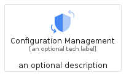
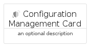
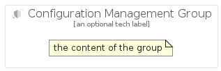

# ConfigurationManagement


```text
gcp/Item/ConfigurationManagement
```

```text
include('gcp/Item/ConfigurationManagement')
```


| Illustration | ConfigurationManagement | ConfigurationManagementCard | ConfigurationManagementGroup |
| :---: | :---: | :---: | :---: |
|  |  |  |  |


## ConfigurationManagement

### Load remotely
```plantuml
@startuml
' configures the library
!global $LIB_BASE_LOCATION="https://raw.githubusercontent.com/tmorin/plantuml-libs/master/distribution"

' loads the library's bootstrap
!include $LIB_BASE_LOCATION/bootstrap.puml

' loads the package bootstrap
include('gcp/bootstrap')

' loads the Item which embeds the element ConfigurationManagement
include('gcp/Item/ConfigurationManagement')

' renders the element
ConfigurationManagement('ConfigurationManagement', 'Configuration Management', 'an optional tech label')
@enduml
```

### Load locally
```plantuml
@startuml
' configures the library
!global $INCLUSION_MODE="local"
!global $LIB_BASE_LOCATION="../.."

' loads the library's bootstrap
!include $LIB_BASE_LOCATION/bootstrap.puml

' loads the package bootstrap
include('gcp/bootstrap')

' loads the Item which embeds the element ConfigurationManagement
include('gcp/Item/ConfigurationManagement')

' renders the element
ConfigurationManagement('ConfigurationManagement', 'Configuration Management', 'an optional tech label')
@enduml
```

## ConfigurationManagementCard

### Load remotely
```plantuml
@startuml
' configures the library
!global $LIB_BASE_LOCATION="https://raw.githubusercontent.com/tmorin/plantuml-libs/master/distribution"

' loads the library's bootstrap
!include $LIB_BASE_LOCATION/bootstrap.puml

' loads the package bootstrap
include('gcp/bootstrap')

' loads the Item which embeds the element ConfigurationManagementCard
include('gcp/Item/ConfigurationManagement')

' renders the element
ConfigurationManagementCard('ConfigurationManagementCard', 'Configuration Management Card', 'an optional description')
@enduml
```

### Load locally
```plantuml
@startuml
' configures the library
!global $INCLUSION_MODE="local"
!global $LIB_BASE_LOCATION="../.."

' loads the library's bootstrap
!include $LIB_BASE_LOCATION/bootstrap.puml

' loads the package bootstrap
include('gcp/bootstrap')

' loads the Item which embeds the element ConfigurationManagementCard
include('gcp/Item/ConfigurationManagement')

' renders the element
ConfigurationManagementCard('ConfigurationManagementCard', 'Configuration Management Card', 'an optional description')
@enduml
```

## ConfigurationManagementGroup

### Load remotely
```plantuml
@startuml
' configures the library
!global $LIB_BASE_LOCATION="https://raw.githubusercontent.com/tmorin/plantuml-libs/master/distribution"

' loads the library's bootstrap
!include $LIB_BASE_LOCATION/bootstrap.puml

' loads the package bootstrap
include('gcp/bootstrap')

' loads the Item which embeds the element ConfigurationManagementGroup
include('gcp/Item/ConfigurationManagement')

' renders the element
ConfigurationManagementGroup('ConfigurationManagementGroup', 'Configuration Management Group', 'an optional tech label') {
    note as note
        the content of the group
    end note
}
@enduml
```

### Load locally
```plantuml
@startuml
' configures the library
!global $INCLUSION_MODE="local"
!global $LIB_BASE_LOCATION="../.."

' loads the library's bootstrap
!include $LIB_BASE_LOCATION/bootstrap.puml

' loads the package bootstrap
include('gcp/bootstrap')

' loads the Item which embeds the element ConfigurationManagementGroup
include('gcp/Item/ConfigurationManagement')

' renders the element
ConfigurationManagementGroup('ConfigurationManagementGroup', 'Configuration Management Group', 'an optional tech label') {
    note as note
        the content of the group
    end note
}
@enduml
```

