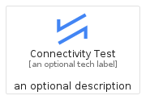
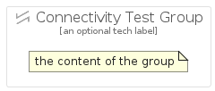

# ConnectivityTest


```text
gcp/Item/ConnectivityTest
```

```text
include('gcp/Item/ConnectivityTest')
```


| Illustration | ConnectivityTest | ConnectivityTestCard | ConnectivityTestGroup |
| :---: | :---: | :---: | :---: |
|  |  |  |  |


## ConnectivityTest

### Load remotely
```plantuml
@startuml
' configures the library
!global $LIB_BASE_LOCATION="https://raw.githubusercontent.com/tmorin/plantuml-libs/master/distribution"

' loads the library's bootstrap
!include $LIB_BASE_LOCATION/bootstrap.puml

' loads the package bootstrap
include('gcp/bootstrap')

' loads the Item which embeds the element ConnectivityTest
include('gcp/Item/ConnectivityTest')

' renders the element
ConnectivityTest('ConnectivityTest', 'Connectivity Test', 'an optional tech label')
@enduml
```

### Load locally
```plantuml
@startuml
' configures the library
!global $INCLUSION_MODE="local"
!global $LIB_BASE_LOCATION="../.."

' loads the library's bootstrap
!include $LIB_BASE_LOCATION/bootstrap.puml

' loads the package bootstrap
include('gcp/bootstrap')

' loads the Item which embeds the element ConnectivityTest
include('gcp/Item/ConnectivityTest')

' renders the element
ConnectivityTest('ConnectivityTest', 'Connectivity Test', 'an optional tech label')
@enduml
```

## ConnectivityTestCard

### Load remotely
```plantuml
@startuml
' configures the library
!global $LIB_BASE_LOCATION="https://raw.githubusercontent.com/tmorin/plantuml-libs/master/distribution"

' loads the library's bootstrap
!include $LIB_BASE_LOCATION/bootstrap.puml

' loads the package bootstrap
include('gcp/bootstrap')

' loads the Item which embeds the element ConnectivityTestCard
include('gcp/Item/ConnectivityTest')

' renders the element
ConnectivityTestCard('ConnectivityTestCard', 'Connectivity Test Card', 'an optional description')
@enduml
```

### Load locally
```plantuml
@startuml
' configures the library
!global $INCLUSION_MODE="local"
!global $LIB_BASE_LOCATION="../.."

' loads the library's bootstrap
!include $LIB_BASE_LOCATION/bootstrap.puml

' loads the package bootstrap
include('gcp/bootstrap')

' loads the Item which embeds the element ConnectivityTestCard
include('gcp/Item/ConnectivityTest')

' renders the element
ConnectivityTestCard('ConnectivityTestCard', 'Connectivity Test Card', 'an optional description')
@enduml
```

## ConnectivityTestGroup

### Load remotely
```plantuml
@startuml
' configures the library
!global $LIB_BASE_LOCATION="https://raw.githubusercontent.com/tmorin/plantuml-libs/master/distribution"

' loads the library's bootstrap
!include $LIB_BASE_LOCATION/bootstrap.puml

' loads the package bootstrap
include('gcp/bootstrap')

' loads the Item which embeds the element ConnectivityTestGroup
include('gcp/Item/ConnectivityTest')

' renders the element
ConnectivityTestGroup('ConnectivityTestGroup', 'Connectivity Test Group', 'an optional tech label') {
    note as note
        the content of the group
    end note
}
@enduml
```

### Load locally
```plantuml
@startuml
' configures the library
!global $INCLUSION_MODE="local"
!global $LIB_BASE_LOCATION="../.."

' loads the library's bootstrap
!include $LIB_BASE_LOCATION/bootstrap.puml

' loads the package bootstrap
include('gcp/bootstrap')

' loads the Item which embeds the element ConnectivityTestGroup
include('gcp/Item/ConnectivityTest')

' renders the element
ConnectivityTestGroup('ConnectivityTestGroup', 'Connectivity Test Group', 'an optional tech label') {
    note as note
        the content of the group
    end note
}
@enduml
```

