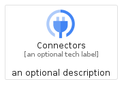
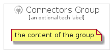

# Connectors


```text
gcp/Item/Connectors
```

```text
include('gcp/Item/Connectors')
```


| Illustration | Connectors | ConnectorsCard | ConnectorsGroup |
| :---: | :---: | :---: | :---: |
|  |  |  |  |


## Connectors

### Load remotely
```plantuml
@startuml
' configures the library
!global $LIB_BASE_LOCATION="https://raw.githubusercontent.com/tmorin/plantuml-libs/master/distribution"

' loads the library's bootstrap
!include $LIB_BASE_LOCATION/bootstrap.puml

' loads the package bootstrap
include('gcp/bootstrap')

' loads the Item which embeds the element Connectors
include('gcp/Item/Connectors')

' renders the element
Connectors('Connectors', 'Connectors', 'an optional tech label')
@enduml
```

### Load locally
```plantuml
@startuml
' configures the library
!global $INCLUSION_MODE="local"
!global $LIB_BASE_LOCATION="../.."

' loads the library's bootstrap
!include $LIB_BASE_LOCATION/bootstrap.puml

' loads the package bootstrap
include('gcp/bootstrap')

' loads the Item which embeds the element Connectors
include('gcp/Item/Connectors')

' renders the element
Connectors('Connectors', 'Connectors', 'an optional tech label')
@enduml
```

## ConnectorsCard

### Load remotely
```plantuml
@startuml
' configures the library
!global $LIB_BASE_LOCATION="https://raw.githubusercontent.com/tmorin/plantuml-libs/master/distribution"

' loads the library's bootstrap
!include $LIB_BASE_LOCATION/bootstrap.puml

' loads the package bootstrap
include('gcp/bootstrap')

' loads the Item which embeds the element ConnectorsCard
include('gcp/Item/Connectors')

' renders the element
ConnectorsCard('ConnectorsCard', 'Connectors Card', 'an optional description')
@enduml
```

### Load locally
```plantuml
@startuml
' configures the library
!global $INCLUSION_MODE="local"
!global $LIB_BASE_LOCATION="../.."

' loads the library's bootstrap
!include $LIB_BASE_LOCATION/bootstrap.puml

' loads the package bootstrap
include('gcp/bootstrap')

' loads the Item which embeds the element ConnectorsCard
include('gcp/Item/Connectors')

' renders the element
ConnectorsCard('ConnectorsCard', 'Connectors Card', 'an optional description')
@enduml
```

## ConnectorsGroup

### Load remotely
```plantuml
@startuml
' configures the library
!global $LIB_BASE_LOCATION="https://raw.githubusercontent.com/tmorin/plantuml-libs/master/distribution"

' loads the library's bootstrap
!include $LIB_BASE_LOCATION/bootstrap.puml

' loads the package bootstrap
include('gcp/bootstrap')

' loads the Item which embeds the element ConnectorsGroup
include('gcp/Item/Connectors')

' renders the element
ConnectorsGroup('ConnectorsGroup', 'Connectors Group', 'an optional tech label') {
    note as note
        the content of the group
    end note
}
@enduml
```

### Load locally
```plantuml
@startuml
' configures the library
!global $INCLUSION_MODE="local"
!global $LIB_BASE_LOCATION="../.."

' loads the library's bootstrap
!include $LIB_BASE_LOCATION/bootstrap.puml

' loads the package bootstrap
include('gcp/bootstrap')

' loads the Item which embeds the element ConnectorsGroup
include('gcp/Item/Connectors')

' renders the element
ConnectorsGroup('ConnectorsGroup', 'Connectors Group', 'an optional tech label') {
    note as note
        the content of the group
    end note
}
@enduml
```

