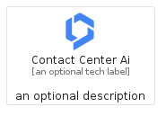
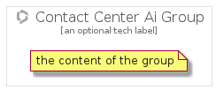

# ContactCenterAi


```text
gcp/Item/ContactCenterAi
```

```text
include('gcp/Item/ContactCenterAi')
```


| Illustration | ContactCenterAi | ContactCenterAiCard | ContactCenterAiGroup |
| :---: | :---: | :---: | :---: |
|  |  |  |  |


## ContactCenterAi

### Load remotely
```plantuml
@startuml
' configures the library
!global $LIB_BASE_LOCATION="https://raw.githubusercontent.com/tmorin/plantuml-libs/master/distribution"

' loads the library's bootstrap
!include $LIB_BASE_LOCATION/bootstrap.puml

' loads the package bootstrap
include('gcp/bootstrap')

' loads the Item which embeds the element ContactCenterAi
include('gcp/Item/ContactCenterAi')

' renders the element
ContactCenterAi('ContactCenterAi', 'Contact Center Ai', 'an optional tech label', 'an optional description')
@enduml
```

### Load locally
```plantuml
@startuml
' configures the library
!global $INCLUSION_MODE="local"
!global $LIB_BASE_LOCATION="../.."

' loads the library's bootstrap
!include $LIB_BASE_LOCATION/bootstrap.puml

' loads the package bootstrap
include('gcp/bootstrap')

' loads the Item which embeds the element ContactCenterAi
include('gcp/Item/ContactCenterAi')

' renders the element
ContactCenterAi('ContactCenterAi', 'Contact Center Ai', 'an optional tech label', 'an optional description')
@enduml
```

## ContactCenterAiCard

### Load remotely
```plantuml
@startuml
' configures the library
!global $LIB_BASE_LOCATION="https://raw.githubusercontent.com/tmorin/plantuml-libs/master/distribution"

' loads the library's bootstrap
!include $LIB_BASE_LOCATION/bootstrap.puml

' loads the package bootstrap
include('gcp/bootstrap')

' loads the Item which embeds the element ContactCenterAiCard
include('gcp/Item/ContactCenterAi')

' renders the element
ContactCenterAiCard('ContactCenterAiCard', 'Contact Center Ai Card', 'an optional description')
@enduml
```

### Load locally
```plantuml
@startuml
' configures the library
!global $INCLUSION_MODE="local"
!global $LIB_BASE_LOCATION="../.."

' loads the library's bootstrap
!include $LIB_BASE_LOCATION/bootstrap.puml

' loads the package bootstrap
include('gcp/bootstrap')

' loads the Item which embeds the element ContactCenterAiCard
include('gcp/Item/ContactCenterAi')

' renders the element
ContactCenterAiCard('ContactCenterAiCard', 'Contact Center Ai Card', 'an optional description')
@enduml
```

## ContactCenterAiGroup

### Load remotely
```plantuml
@startuml
' configures the library
!global $LIB_BASE_LOCATION="https://raw.githubusercontent.com/tmorin/plantuml-libs/master/distribution"

' loads the library's bootstrap
!include $LIB_BASE_LOCATION/bootstrap.puml

' loads the package bootstrap
include('gcp/bootstrap')

' loads the Item which embeds the element ContactCenterAiGroup
include('gcp/Item/ContactCenterAi')

' renders the element
ContactCenterAiGroup('ContactCenterAiGroup', 'Contact Center Ai Group', 'an optional tech label') {
    note as note
        the content of the group
    end note
}
@enduml
```

### Load locally
```plantuml
@startuml
' configures the library
!global $INCLUSION_MODE="local"
!global $LIB_BASE_LOCATION="../.."

' loads the library's bootstrap
!include $LIB_BASE_LOCATION/bootstrap.puml

' loads the package bootstrap
include('gcp/bootstrap')

' loads the Item which embeds the element ContactCenterAiGroup
include('gcp/Item/ContactCenterAi')

' renders the element
ContactCenterAiGroup('ContactCenterAiGroup', 'Contact Center Ai Group', 'an optional tech label') {
    note as note
        the content of the group
    end note
}
@enduml
```

