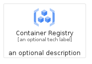
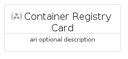

# ContainerRegistry


```text
gcp/Item/ContainerRegistry
```

```text
include('gcp/Item/ContainerRegistry')
```


| Illustration | ContainerRegistry | ContainerRegistryCard | ContainerRegistryGroup |
| :---: | :---: | :---: | :---: |
|  |  |  |  |


## ContainerRegistry

### Load remotely
```plantuml
@startuml
' configures the library
!global $LIB_BASE_LOCATION="https://raw.githubusercontent.com/tmorin/plantuml-libs/master/distribution"

' loads the library's bootstrap
!include $LIB_BASE_LOCATION/bootstrap.puml

' loads the package bootstrap
include('gcp/bootstrap')

' loads the Item which embeds the element ContainerRegistry
include('gcp/Item/ContainerRegistry')

' renders the element
ContainerRegistry('ContainerRegistry', 'Container Registry', 'an optional tech label', 'an optional description')
@enduml
```

### Load locally
```plantuml
@startuml
' configures the library
!global $INCLUSION_MODE="local"
!global $LIB_BASE_LOCATION="../.."

' loads the library's bootstrap
!include $LIB_BASE_LOCATION/bootstrap.puml

' loads the package bootstrap
include('gcp/bootstrap')

' loads the Item which embeds the element ContainerRegistry
include('gcp/Item/ContainerRegistry')

' renders the element
ContainerRegistry('ContainerRegistry', 'Container Registry', 'an optional tech label', 'an optional description')
@enduml
```

## ContainerRegistryCard

### Load remotely
```plantuml
@startuml
' configures the library
!global $LIB_BASE_LOCATION="https://raw.githubusercontent.com/tmorin/plantuml-libs/master/distribution"

' loads the library's bootstrap
!include $LIB_BASE_LOCATION/bootstrap.puml

' loads the package bootstrap
include('gcp/bootstrap')

' loads the Item which embeds the element ContainerRegistryCard
include('gcp/Item/ContainerRegistry')

' renders the element
ContainerRegistryCard('ContainerRegistryCard', 'Container Registry Card', 'an optional description')
@enduml
```

### Load locally
```plantuml
@startuml
' configures the library
!global $INCLUSION_MODE="local"
!global $LIB_BASE_LOCATION="../.."

' loads the library's bootstrap
!include $LIB_BASE_LOCATION/bootstrap.puml

' loads the package bootstrap
include('gcp/bootstrap')

' loads the Item which embeds the element ContainerRegistryCard
include('gcp/Item/ContainerRegistry')

' renders the element
ContainerRegistryCard('ContainerRegistryCard', 'Container Registry Card', 'an optional description')
@enduml
```

## ContainerRegistryGroup

### Load remotely
```plantuml
@startuml
' configures the library
!global $LIB_BASE_LOCATION="https://raw.githubusercontent.com/tmorin/plantuml-libs/master/distribution"

' loads the library's bootstrap
!include $LIB_BASE_LOCATION/bootstrap.puml

' loads the package bootstrap
include('gcp/bootstrap')

' loads the Item which embeds the element ContainerRegistryGroup
include('gcp/Item/ContainerRegistry')

' renders the element
ContainerRegistryGroup('ContainerRegistryGroup', 'Container Registry Group', 'an optional tech label') {
    note as note
        the content of the group
    end note
}
@enduml
```

### Load locally
```plantuml
@startuml
' configures the library
!global $INCLUSION_MODE="local"
!global $LIB_BASE_LOCATION="../.."

' loads the library's bootstrap
!include $LIB_BASE_LOCATION/bootstrap.puml

' loads the package bootstrap
include('gcp/bootstrap')

' loads the Item which embeds the element ContainerRegistryGroup
include('gcp/Item/ContainerRegistry')

' renders the element
ContainerRegistryGroup('ContainerRegistryGroup', 'Container Registry Group', 'an optional tech label') {
    note as note
        the content of the group
    end note
}
@enduml
```

