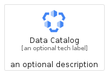
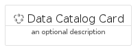
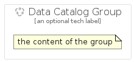

# DataCatalog


```text
gcp/Item/DataCatalog
```

```text
include('gcp/Item/DataCatalog')
```


| Illustration | DataCatalog | DataCatalogCard | DataCatalogGroup |
| :---: | :---: | :---: | :---: |
|  |  |  |  |


## Sprites
The item provides the following sriptes:

- `<$DataCatalogXs>`
- `<$DataCatalogSm>`
- `<$DataCatalogMd>`
- `<$DataCatalogLg>`


## DataCatalog

### Load remotely
```plantuml
@startuml
' configures the library
!global $LIB_BASE_LOCATION="https://raw.githubusercontent.com/tmorin/plantuml-libs/master/distribution"

' loads the library's bootstrap
!include $LIB_BASE_LOCATION/bootstrap.puml

' loads the package bootstrap
include('gcp/bootstrap')

' loads the Item which embeds the element DataCatalog
include('gcp/Item/DataCatalog')

' renders the element
DataCatalog('DataCatalog', 'Data Catalog', 'an optional tech label', 'an optional description')
@enduml
```

### Load locally
```plantuml
@startuml
' configures the library
!global $INCLUSION_MODE="local"
!global $LIB_BASE_LOCATION="../.."

' loads the library's bootstrap
!include $LIB_BASE_LOCATION/bootstrap.puml

' loads the package bootstrap
include('gcp/bootstrap')

' loads the Item which embeds the element DataCatalog
include('gcp/Item/DataCatalog')

' renders the element
DataCatalog('DataCatalog', 'Data Catalog', 'an optional tech label', 'an optional description')
@enduml
```

## DataCatalogCard

### Load remotely
```plantuml
@startuml
' configures the library
!global $LIB_BASE_LOCATION="https://raw.githubusercontent.com/tmorin/plantuml-libs/master/distribution"

' loads the library's bootstrap
!include $LIB_BASE_LOCATION/bootstrap.puml

' loads the package bootstrap
include('gcp/bootstrap')

' loads the Item which embeds the element DataCatalogCard
include('gcp/Item/DataCatalog')

' renders the element
DataCatalogCard('DataCatalogCard', 'Data Catalog Card', 'an optional description')
@enduml
```

### Load locally
```plantuml
@startuml
' configures the library
!global $INCLUSION_MODE="local"
!global $LIB_BASE_LOCATION="../.."

' loads the library's bootstrap
!include $LIB_BASE_LOCATION/bootstrap.puml

' loads the package bootstrap
include('gcp/bootstrap')

' loads the Item which embeds the element DataCatalogCard
include('gcp/Item/DataCatalog')

' renders the element
DataCatalogCard('DataCatalogCard', 'Data Catalog Card', 'an optional description')
@enduml
```

## DataCatalogGroup

### Load remotely
```plantuml
@startuml
' configures the library
!global $LIB_BASE_LOCATION="https://raw.githubusercontent.com/tmorin/plantuml-libs/master/distribution"

' loads the library's bootstrap
!include $LIB_BASE_LOCATION/bootstrap.puml

' loads the package bootstrap
include('gcp/bootstrap')

' loads the Item which embeds the element DataCatalogGroup
include('gcp/Item/DataCatalog')

' renders the element
DataCatalogGroup('DataCatalogGroup', 'Data Catalog Group', 'an optional tech label') {
    note as note
        the content of the group
    end note
}
@enduml
```

### Load locally
```plantuml
@startuml
' configures the library
!global $INCLUSION_MODE="local"
!global $LIB_BASE_LOCATION="../.."

' loads the library's bootstrap
!include $LIB_BASE_LOCATION/bootstrap.puml

' loads the package bootstrap
include('gcp/bootstrap')

' loads the Item which embeds the element DataCatalogGroup
include('gcp/Item/DataCatalog')

' renders the element
DataCatalogGroup('DataCatalogGroup', 'Data Catalog Group', 'an optional tech label') {
    note as note
        the content of the group
    end note
}
@enduml
```

