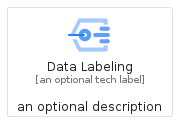
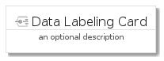
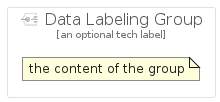

# DataLabeling


```text
gcp/Item/DataLabeling
```

```text
include('gcp/Item/DataLabeling')
```


| Illustration | DataLabeling | DataLabelingCard | DataLabelingGroup |
| :---: | :---: | :---: | :---: |
|  |  |  |  |


## Sprites
The item provides the following sriptes:

- `<$DataLabelingXs>`
- `<$DataLabelingSm>`
- `<$DataLabelingMd>`
- `<$DataLabelingLg>`


## DataLabeling

### Load remotely
```plantuml
@startuml
' configures the library
!global $LIB_BASE_LOCATION="https://raw.githubusercontent.com/tmorin/plantuml-libs/master/distribution"

' loads the library's bootstrap
!include $LIB_BASE_LOCATION/bootstrap.puml

' loads the package bootstrap
include('gcp/bootstrap')

' loads the Item which embeds the element DataLabeling
include('gcp/Item/DataLabeling')

' renders the element
DataLabeling('DataLabeling', 'Data Labeling', 'an optional tech label', 'an optional description')
@enduml
```

### Load locally
```plantuml
@startuml
' configures the library
!global $INCLUSION_MODE="local"
!global $LIB_BASE_LOCATION="../.."

' loads the library's bootstrap
!include $LIB_BASE_LOCATION/bootstrap.puml

' loads the package bootstrap
include('gcp/bootstrap')

' loads the Item which embeds the element DataLabeling
include('gcp/Item/DataLabeling')

' renders the element
DataLabeling('DataLabeling', 'Data Labeling', 'an optional tech label', 'an optional description')
@enduml
```

## DataLabelingCard

### Load remotely
```plantuml
@startuml
' configures the library
!global $LIB_BASE_LOCATION="https://raw.githubusercontent.com/tmorin/plantuml-libs/master/distribution"

' loads the library's bootstrap
!include $LIB_BASE_LOCATION/bootstrap.puml

' loads the package bootstrap
include('gcp/bootstrap')

' loads the Item which embeds the element DataLabelingCard
include('gcp/Item/DataLabeling')

' renders the element
DataLabelingCard('DataLabelingCard', 'Data Labeling Card', 'an optional description')
@enduml
```

### Load locally
```plantuml
@startuml
' configures the library
!global $INCLUSION_MODE="local"
!global $LIB_BASE_LOCATION="../.."

' loads the library's bootstrap
!include $LIB_BASE_LOCATION/bootstrap.puml

' loads the package bootstrap
include('gcp/bootstrap')

' loads the Item which embeds the element DataLabelingCard
include('gcp/Item/DataLabeling')

' renders the element
DataLabelingCard('DataLabelingCard', 'Data Labeling Card', 'an optional description')
@enduml
```

## DataLabelingGroup

### Load remotely
```plantuml
@startuml
' configures the library
!global $LIB_BASE_LOCATION="https://raw.githubusercontent.com/tmorin/plantuml-libs/master/distribution"

' loads the library's bootstrap
!include $LIB_BASE_LOCATION/bootstrap.puml

' loads the package bootstrap
include('gcp/bootstrap')

' loads the Item which embeds the element DataLabelingGroup
include('gcp/Item/DataLabeling')

' renders the element
DataLabelingGroup('DataLabelingGroup', 'Data Labeling Group', 'an optional tech label') {
    note as note
        the content of the group
    end note
}
@enduml
```

### Load locally
```plantuml
@startuml
' configures the library
!global $INCLUSION_MODE="local"
!global $LIB_BASE_LOCATION="../.."

' loads the library's bootstrap
!include $LIB_BASE_LOCATION/bootstrap.puml

' loads the package bootstrap
include('gcp/bootstrap')

' loads the Item which embeds the element DataLabelingGroup
include('gcp/Item/DataLabeling')

' renders the element
DataLabelingGroup('DataLabelingGroup', 'Data Labeling Group', 'an optional tech label') {
    note as note
        the content of the group
    end note
}
@enduml
```

