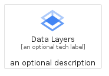
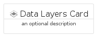
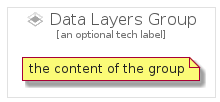

# DataLayers


```text
gcp/Item/DataLayers
```

```text
include('gcp/Item/DataLayers')
```


| Illustration | DataLayers | DataLayersCard | DataLayersGroup |
| :---: | :---: | :---: | :---: |
|  |  |  |  |


## DataLayers

### Load remotely
```plantuml
@startuml
' configures the library
!global $LIB_BASE_LOCATION="https://raw.githubusercontent.com/tmorin/plantuml-libs/master/distribution"

' loads the library's bootstrap
!include $LIB_BASE_LOCATION/bootstrap.puml

' loads the package bootstrap
include('gcp/bootstrap')

' loads the Item which embeds the element DataLayers
include('gcp/Item/DataLayers')

' renders the element
DataLayers('DataLayers', 'Data Layers', 'an optional tech label', 'an optional description')
@enduml
```

### Load locally
```plantuml
@startuml
' configures the library
!global $INCLUSION_MODE="local"
!global $LIB_BASE_LOCATION="../.."

' loads the library's bootstrap
!include $LIB_BASE_LOCATION/bootstrap.puml

' loads the package bootstrap
include('gcp/bootstrap')

' loads the Item which embeds the element DataLayers
include('gcp/Item/DataLayers')

' renders the element
DataLayers('DataLayers', 'Data Layers', 'an optional tech label', 'an optional description')
@enduml
```

## DataLayersCard

### Load remotely
```plantuml
@startuml
' configures the library
!global $LIB_BASE_LOCATION="https://raw.githubusercontent.com/tmorin/plantuml-libs/master/distribution"

' loads the library's bootstrap
!include $LIB_BASE_LOCATION/bootstrap.puml

' loads the package bootstrap
include('gcp/bootstrap')

' loads the Item which embeds the element DataLayersCard
include('gcp/Item/DataLayers')

' renders the element
DataLayersCard('DataLayersCard', 'Data Layers Card', 'an optional description')
@enduml
```

### Load locally
```plantuml
@startuml
' configures the library
!global $INCLUSION_MODE="local"
!global $LIB_BASE_LOCATION="../.."

' loads the library's bootstrap
!include $LIB_BASE_LOCATION/bootstrap.puml

' loads the package bootstrap
include('gcp/bootstrap')

' loads the Item which embeds the element DataLayersCard
include('gcp/Item/DataLayers')

' renders the element
DataLayersCard('DataLayersCard', 'Data Layers Card', 'an optional description')
@enduml
```

## DataLayersGroup

### Load remotely
```plantuml
@startuml
' configures the library
!global $LIB_BASE_LOCATION="https://raw.githubusercontent.com/tmorin/plantuml-libs/master/distribution"

' loads the library's bootstrap
!include $LIB_BASE_LOCATION/bootstrap.puml

' loads the package bootstrap
include('gcp/bootstrap')

' loads the Item which embeds the element DataLayersGroup
include('gcp/Item/DataLayers')

' renders the element
DataLayersGroup('DataLayersGroup', 'Data Layers Group', 'an optional tech label') {
    note as note
        the content of the group
    end note
}
@enduml
```

### Load locally
```plantuml
@startuml
' configures the library
!global $INCLUSION_MODE="local"
!global $LIB_BASE_LOCATION="../.."

' loads the library's bootstrap
!include $LIB_BASE_LOCATION/bootstrap.puml

' loads the package bootstrap
include('gcp/bootstrap')

' loads the Item which embeds the element DataLayersGroup
include('gcp/Item/DataLayers')

' renders the element
DataLayersGroup('DataLayersGroup', 'Data Layers Group', 'an optional tech label') {
    note as note
        the content of the group
    end note
}
@enduml
```

