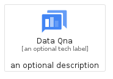
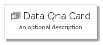
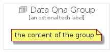

# DataQna


```text
gcp/Item/DataQna
```

```text
include('gcp/Item/DataQna')
```


| Illustration | DataQna | DataQnaCard | DataQnaGroup |
| :---: | :---: | :---: | :---: |
|  |  |  |  |


## Sprites
The item provides the following sriptes:

- `<$DataQnaXs>`
- `<$DataQnaSm>`
- `<$DataQnaMd>`
- `<$DataQnaLg>`


## DataQna

### Load remotely
```plantuml
@startuml
' configures the library
!global $LIB_BASE_LOCATION="https://raw.githubusercontent.com/tmorin/plantuml-libs/master/distribution"

' loads the library's bootstrap
!include $LIB_BASE_LOCATION/bootstrap.puml

' loads the package bootstrap
include('gcp/bootstrap')

' loads the Item which embeds the element DataQna
include('gcp/Item/DataQna')

' renders the element
DataQna('DataQna', 'Data Qna', 'an optional tech label', 'an optional description')
@enduml
```

### Load locally
```plantuml
@startuml
' configures the library
!global $INCLUSION_MODE="local"
!global $LIB_BASE_LOCATION="../.."

' loads the library's bootstrap
!include $LIB_BASE_LOCATION/bootstrap.puml

' loads the package bootstrap
include('gcp/bootstrap')

' loads the Item which embeds the element DataQna
include('gcp/Item/DataQna')

' renders the element
DataQna('DataQna', 'Data Qna', 'an optional tech label', 'an optional description')
@enduml
```

## DataQnaCard

### Load remotely
```plantuml
@startuml
' configures the library
!global $LIB_BASE_LOCATION="https://raw.githubusercontent.com/tmorin/plantuml-libs/master/distribution"

' loads the library's bootstrap
!include $LIB_BASE_LOCATION/bootstrap.puml

' loads the package bootstrap
include('gcp/bootstrap')

' loads the Item which embeds the element DataQnaCard
include('gcp/Item/DataQna')

' renders the element
DataQnaCard('DataQnaCard', 'Data Qna Card', 'an optional description')
@enduml
```

### Load locally
```plantuml
@startuml
' configures the library
!global $INCLUSION_MODE="local"
!global $LIB_BASE_LOCATION="../.."

' loads the library's bootstrap
!include $LIB_BASE_LOCATION/bootstrap.puml

' loads the package bootstrap
include('gcp/bootstrap')

' loads the Item which embeds the element DataQnaCard
include('gcp/Item/DataQna')

' renders the element
DataQnaCard('DataQnaCard', 'Data Qna Card', 'an optional description')
@enduml
```

## DataQnaGroup

### Load remotely
```plantuml
@startuml
' configures the library
!global $LIB_BASE_LOCATION="https://raw.githubusercontent.com/tmorin/plantuml-libs/master/distribution"

' loads the library's bootstrap
!include $LIB_BASE_LOCATION/bootstrap.puml

' loads the package bootstrap
include('gcp/bootstrap')

' loads the Item which embeds the element DataQnaGroup
include('gcp/Item/DataQna')

' renders the element
DataQnaGroup('DataQnaGroup', 'Data Qna Group', 'an optional tech label') {
    note as note
        the content of the group
    end note
}
@enduml
```

### Load locally
```plantuml
@startuml
' configures the library
!global $INCLUSION_MODE="local"
!global $LIB_BASE_LOCATION="../.."

' loads the library's bootstrap
!include $LIB_BASE_LOCATION/bootstrap.puml

' loads the package bootstrap
include('gcp/bootstrap')

' loads the Item which embeds the element DataQnaGroup
include('gcp/Item/DataQna')

' renders the element
DataQnaGroup('DataQnaGroup', 'Data Qna Group', 'an optional tech label') {
    note as note
        the content of the group
    end note
}
@enduml
```

