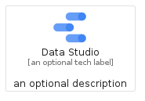
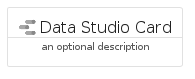
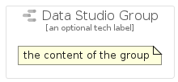

# DataStudio


```text
gcp/Item/DataStudio
```

```text
include('gcp/Item/DataStudio')
```


| Illustration | DataStudio | DataStudioCard | DataStudioGroup |
| :---: | :---: | :---: | :---: |
|  |  |  |  |


## Sprites
The item provides the following sriptes:

- `<$DataStudioXs>`
- `<$DataStudioSm>`
- `<$DataStudioMd>`
- `<$DataStudioLg>`


## DataStudio

### Load remotely
```plantuml
@startuml
' configures the library
!global $LIB_BASE_LOCATION="https://raw.githubusercontent.com/tmorin/plantuml-libs/master/distribution"

' loads the library's bootstrap
!include $LIB_BASE_LOCATION/bootstrap.puml

' loads the package bootstrap
include('gcp/bootstrap')

' loads the Item which embeds the element DataStudio
include('gcp/Item/DataStudio')

' renders the element
DataStudio('DataStudio', 'Data Studio', 'an optional tech label', 'an optional description')
@enduml
```

### Load locally
```plantuml
@startuml
' configures the library
!global $INCLUSION_MODE="local"
!global $LIB_BASE_LOCATION="../.."

' loads the library's bootstrap
!include $LIB_BASE_LOCATION/bootstrap.puml

' loads the package bootstrap
include('gcp/bootstrap')

' loads the Item which embeds the element DataStudio
include('gcp/Item/DataStudio')

' renders the element
DataStudio('DataStudio', 'Data Studio', 'an optional tech label', 'an optional description')
@enduml
```

## DataStudioCard

### Load remotely
```plantuml
@startuml
' configures the library
!global $LIB_BASE_LOCATION="https://raw.githubusercontent.com/tmorin/plantuml-libs/master/distribution"

' loads the library's bootstrap
!include $LIB_BASE_LOCATION/bootstrap.puml

' loads the package bootstrap
include('gcp/bootstrap')

' loads the Item which embeds the element DataStudioCard
include('gcp/Item/DataStudio')

' renders the element
DataStudioCard('DataStudioCard', 'Data Studio Card', 'an optional description')
@enduml
```

### Load locally
```plantuml
@startuml
' configures the library
!global $INCLUSION_MODE="local"
!global $LIB_BASE_LOCATION="../.."

' loads the library's bootstrap
!include $LIB_BASE_LOCATION/bootstrap.puml

' loads the package bootstrap
include('gcp/bootstrap')

' loads the Item which embeds the element DataStudioCard
include('gcp/Item/DataStudio')

' renders the element
DataStudioCard('DataStudioCard', 'Data Studio Card', 'an optional description')
@enduml
```

## DataStudioGroup

### Load remotely
```plantuml
@startuml
' configures the library
!global $LIB_BASE_LOCATION="https://raw.githubusercontent.com/tmorin/plantuml-libs/master/distribution"

' loads the library's bootstrap
!include $LIB_BASE_LOCATION/bootstrap.puml

' loads the package bootstrap
include('gcp/bootstrap')

' loads the Item which embeds the element DataStudioGroup
include('gcp/Item/DataStudio')

' renders the element
DataStudioGroup('DataStudioGroup', 'Data Studio Group', 'an optional tech label') {
    note as note
        the content of the group
    end note
}
@enduml
```

### Load locally
```plantuml
@startuml
' configures the library
!global $INCLUSION_MODE="local"
!global $LIB_BASE_LOCATION="../.."

' loads the library's bootstrap
!include $LIB_BASE_LOCATION/bootstrap.puml

' loads the package bootstrap
include('gcp/bootstrap')

' loads the Item which embeds the element DataStudioGroup
include('gcp/Item/DataStudio')

' renders the element
DataStudioGroup('DataStudioGroup', 'Data Studio Group', 'an optional tech label') {
    note as note
        the content of the group
    end note
}
@enduml
```

