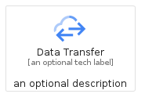
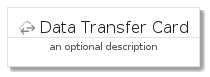
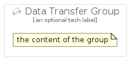

# DataTransfer


```text
gcp/Item/DataTransfer
```

```text
include('gcp/Item/DataTransfer')
```


| Illustration | DataTransfer | DataTransferCard | DataTransferGroup |
| :---: | :---: | :---: | :---: |
|  |  |  |  |


## DataTransfer

### Load remotely
```plantuml
@startuml
' configures the library
!global $LIB_BASE_LOCATION="https://raw.githubusercontent.com/tmorin/plantuml-libs/master/distribution"

' loads the library's bootstrap
!include $LIB_BASE_LOCATION/bootstrap.puml

' loads the package bootstrap
include('gcp/bootstrap')

' loads the Item which embeds the element DataTransfer
include('gcp/Item/DataTransfer')

' renders the element
DataTransfer('DataTransfer', 'Data Transfer', 'an optional tech label', 'an optional description')
@enduml
```

### Load locally
```plantuml
@startuml
' configures the library
!global $INCLUSION_MODE="local"
!global $LIB_BASE_LOCATION="../.."

' loads the library's bootstrap
!include $LIB_BASE_LOCATION/bootstrap.puml

' loads the package bootstrap
include('gcp/bootstrap')

' loads the Item which embeds the element DataTransfer
include('gcp/Item/DataTransfer')

' renders the element
DataTransfer('DataTransfer', 'Data Transfer', 'an optional tech label', 'an optional description')
@enduml
```

## DataTransferCard

### Load remotely
```plantuml
@startuml
' configures the library
!global $LIB_BASE_LOCATION="https://raw.githubusercontent.com/tmorin/plantuml-libs/master/distribution"

' loads the library's bootstrap
!include $LIB_BASE_LOCATION/bootstrap.puml

' loads the package bootstrap
include('gcp/bootstrap')

' loads the Item which embeds the element DataTransferCard
include('gcp/Item/DataTransfer')

' renders the element
DataTransferCard('DataTransferCard', 'Data Transfer Card', 'an optional description')
@enduml
```

### Load locally
```plantuml
@startuml
' configures the library
!global $INCLUSION_MODE="local"
!global $LIB_BASE_LOCATION="../.."

' loads the library's bootstrap
!include $LIB_BASE_LOCATION/bootstrap.puml

' loads the package bootstrap
include('gcp/bootstrap')

' loads the Item which embeds the element DataTransferCard
include('gcp/Item/DataTransfer')

' renders the element
DataTransferCard('DataTransferCard', 'Data Transfer Card', 'an optional description')
@enduml
```

## DataTransferGroup

### Load remotely
```plantuml
@startuml
' configures the library
!global $LIB_BASE_LOCATION="https://raw.githubusercontent.com/tmorin/plantuml-libs/master/distribution"

' loads the library's bootstrap
!include $LIB_BASE_LOCATION/bootstrap.puml

' loads the package bootstrap
include('gcp/bootstrap')

' loads the Item which embeds the element DataTransferGroup
include('gcp/Item/DataTransfer')

' renders the element
DataTransferGroup('DataTransferGroup', 'Data Transfer Group', 'an optional tech label') {
    note as note
        the content of the group
    end note
}
@enduml
```

### Load locally
```plantuml
@startuml
' configures the library
!global $INCLUSION_MODE="local"
!global $LIB_BASE_LOCATION="../.."

' loads the library's bootstrap
!include $LIB_BASE_LOCATION/bootstrap.puml

' loads the package bootstrap
include('gcp/bootstrap')

' loads the Item which embeds the element DataTransferGroup
include('gcp/Item/DataTransfer')

' renders the element
DataTransferGroup('DataTransferGroup', 'Data Transfer Group', 'an optional tech label') {
    note as note
        the content of the group
    end note
}
@enduml
```

