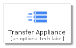
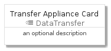
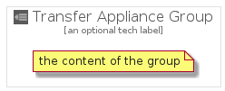

# TransferAppliance


```text
gcp/Item/DataTransfer/TransferAppliance
```

```text
include('gcp/Item/DataTransfer/TransferAppliance')
```


| Illustration | TransferAppliance | TransferApplianceCard | TransferApplianceGroup |
| :---: | :---: | :---: | :---: |
|  |  |  |  |


## TransferAppliance

### Load remotely
```plantuml
@startuml
' configures the library
!global $LIB_BASE_LOCATION="https://raw.githubusercontent.com/tmorin/plantuml-libs/master/distribution"

' loads the library's bootstrap
!include $LIB_BASE_LOCATION/bootstrap.puml

' loads the package bootstrap
include('gcp/bootstrap')

' loads the Item which embeds the element TransferAppliance
include('gcp/Item/DataTransfer/TransferAppliance')

' renders the element
TransferAppliance('TransferAppliance', 'Transfer Appliance', 'an optional tech label')
@enduml
```

### Load locally
```plantuml
@startuml
' configures the library
!global $INCLUSION_MODE="local"
!global $LIB_BASE_LOCATION="../../.."

' loads the library's bootstrap
!include $LIB_BASE_LOCATION/bootstrap.puml

' loads the package bootstrap
include('gcp/bootstrap')

' loads the Item which embeds the element TransferAppliance
include('gcp/Item/DataTransfer/TransferAppliance')

' renders the element
TransferAppliance('TransferAppliance', 'Transfer Appliance', 'an optional tech label')
@enduml
```

## TransferApplianceCard

### Load remotely
```plantuml
@startuml
' configures the library
!global $LIB_BASE_LOCATION="https://raw.githubusercontent.com/tmorin/plantuml-libs/master/distribution"

' loads the library's bootstrap
!include $LIB_BASE_LOCATION/bootstrap.puml

' loads the package bootstrap
include('gcp/bootstrap')

' loads the Item which embeds the element TransferApplianceCard
include('gcp/Item/DataTransfer/TransferAppliance')

' renders the element
TransferApplianceCard('TransferApplianceCard', 'Transfer Appliance Card', 'an optional description')
@enduml
```

### Load locally
```plantuml
@startuml
' configures the library
!global $INCLUSION_MODE="local"
!global $LIB_BASE_LOCATION="../../.."

' loads the library's bootstrap
!include $LIB_BASE_LOCATION/bootstrap.puml

' loads the package bootstrap
include('gcp/bootstrap')

' loads the Item which embeds the element TransferApplianceCard
include('gcp/Item/DataTransfer/TransferAppliance')

' renders the element
TransferApplianceCard('TransferApplianceCard', 'Transfer Appliance Card', 'an optional description')
@enduml
```

## TransferApplianceGroup

### Load remotely
```plantuml
@startuml
' configures the library
!global $LIB_BASE_LOCATION="https://raw.githubusercontent.com/tmorin/plantuml-libs/master/distribution"

' loads the library's bootstrap
!include $LIB_BASE_LOCATION/bootstrap.puml

' loads the package bootstrap
include('gcp/bootstrap')

' loads the Item which embeds the element TransferApplianceGroup
include('gcp/Item/DataTransfer/TransferAppliance')

' renders the element
TransferApplianceGroup('TransferApplianceGroup', 'Transfer Appliance Group', 'an optional tech label') {
    note as note
        the content of the group
    end note
}
@enduml
```

### Load locally
```plantuml
@startuml
' configures the library
!global $INCLUSION_MODE="local"
!global $LIB_BASE_LOCATION="../../.."

' loads the library's bootstrap
!include $LIB_BASE_LOCATION/bootstrap.puml

' loads the package bootstrap
include('gcp/bootstrap')

' loads the Item which embeds the element TransferApplianceGroup
include('gcp/Item/DataTransfer/TransferAppliance')

' renders the element
TransferApplianceGroup('TransferApplianceGroup', 'Transfer Appliance Group', 'an optional tech label') {
    note as note
        the content of the group
    end note
}
@enduml
```

