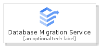
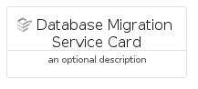
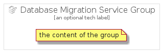

# DatabaseMigrationService


```text
gcp/Item/DatabaseMigrationService
```

```text
include('gcp/Item/DatabaseMigrationService')
```


| Illustration | DatabaseMigrationService | DatabaseMigrationServiceCard | DatabaseMigrationServiceGroup |
| :---: | :---: | :---: | :---: |
|  |  |  |  |


## DatabaseMigrationService

### Load remotely
```plantuml
@startuml
' configures the library
!global $LIB_BASE_LOCATION="https://raw.githubusercontent.com/tmorin/plantuml-libs/master/distribution"

' loads the library's bootstrap
!include $LIB_BASE_LOCATION/bootstrap.puml

' loads the package bootstrap
include('gcp/bootstrap')

' loads the Item which embeds the element DatabaseMigrationService
include('gcp/Item/DatabaseMigrationService')

' renders the element
DatabaseMigrationService('DatabaseMigrationService', 'Database Migration Service', 'an optional tech label', 'an optional description')
@enduml
```

### Load locally
```plantuml
@startuml
' configures the library
!global $INCLUSION_MODE="local"
!global $LIB_BASE_LOCATION="../.."

' loads the library's bootstrap
!include $LIB_BASE_LOCATION/bootstrap.puml

' loads the package bootstrap
include('gcp/bootstrap')

' loads the Item which embeds the element DatabaseMigrationService
include('gcp/Item/DatabaseMigrationService')

' renders the element
DatabaseMigrationService('DatabaseMigrationService', 'Database Migration Service', 'an optional tech label', 'an optional description')
@enduml
```

## DatabaseMigrationServiceCard

### Load remotely
```plantuml
@startuml
' configures the library
!global $LIB_BASE_LOCATION="https://raw.githubusercontent.com/tmorin/plantuml-libs/master/distribution"

' loads the library's bootstrap
!include $LIB_BASE_LOCATION/bootstrap.puml

' loads the package bootstrap
include('gcp/bootstrap')

' loads the Item which embeds the element DatabaseMigrationServiceCard
include('gcp/Item/DatabaseMigrationService')

' renders the element
DatabaseMigrationServiceCard('DatabaseMigrationServiceCard', 'Database Migration Service Card', 'an optional description')
@enduml
```

### Load locally
```plantuml
@startuml
' configures the library
!global $INCLUSION_MODE="local"
!global $LIB_BASE_LOCATION="../.."

' loads the library's bootstrap
!include $LIB_BASE_LOCATION/bootstrap.puml

' loads the package bootstrap
include('gcp/bootstrap')

' loads the Item which embeds the element DatabaseMigrationServiceCard
include('gcp/Item/DatabaseMigrationService')

' renders the element
DatabaseMigrationServiceCard('DatabaseMigrationServiceCard', 'Database Migration Service Card', 'an optional description')
@enduml
```

## DatabaseMigrationServiceGroup

### Load remotely
```plantuml
@startuml
' configures the library
!global $LIB_BASE_LOCATION="https://raw.githubusercontent.com/tmorin/plantuml-libs/master/distribution"

' loads the library's bootstrap
!include $LIB_BASE_LOCATION/bootstrap.puml

' loads the package bootstrap
include('gcp/bootstrap')

' loads the Item which embeds the element DatabaseMigrationServiceGroup
include('gcp/Item/DatabaseMigrationService')

' renders the element
DatabaseMigrationServiceGroup('DatabaseMigrationServiceGroup', 'Database Migration Service Group', 'an optional tech label') {
    note as note
        the content of the group
    end note
}
@enduml
```

### Load locally
```plantuml
@startuml
' configures the library
!global $INCLUSION_MODE="local"
!global $LIB_BASE_LOCATION="../.."

' loads the library's bootstrap
!include $LIB_BASE_LOCATION/bootstrap.puml

' loads the package bootstrap
include('gcp/bootstrap')

' loads the Item which embeds the element DatabaseMigrationServiceGroup
include('gcp/Item/DatabaseMigrationService')

' renders the element
DatabaseMigrationServiceGroup('DatabaseMigrationServiceGroup', 'Database Migration Service Group', 'an optional tech label') {
    note as note
        the content of the group
    end note
}
@enduml
```

