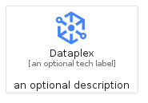
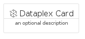
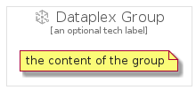

# Dataplex


```text
gcp/Item/Dataplex
```

```text
include('gcp/Item/Dataplex')
```


| Illustration | Dataplex | DataplexCard | DataplexGroup |
| :---: | :---: | :---: | :---: |
|  |  |  |  |


## Sprites
The item provides the following sriptes:

- `<$DataplexXs>`
- `<$DataplexSm>`
- `<$DataplexMd>`
- `<$DataplexLg>`


## Dataplex

### Load remotely
```plantuml
@startuml
' configures the library
!global $LIB_BASE_LOCATION="https://raw.githubusercontent.com/tmorin/plantuml-libs/master/distribution"

' loads the library's bootstrap
!include $LIB_BASE_LOCATION/bootstrap.puml

' loads the package bootstrap
include('gcp/bootstrap')

' loads the Item which embeds the element Dataplex
include('gcp/Item/Dataplex')

' renders the element
Dataplex('Dataplex', 'Dataplex', 'an optional tech label', 'an optional description')
@enduml
```

### Load locally
```plantuml
@startuml
' configures the library
!global $INCLUSION_MODE="local"
!global $LIB_BASE_LOCATION="../.."

' loads the library's bootstrap
!include $LIB_BASE_LOCATION/bootstrap.puml

' loads the package bootstrap
include('gcp/bootstrap')

' loads the Item which embeds the element Dataplex
include('gcp/Item/Dataplex')

' renders the element
Dataplex('Dataplex', 'Dataplex', 'an optional tech label', 'an optional description')
@enduml
```

## DataplexCard

### Load remotely
```plantuml
@startuml
' configures the library
!global $LIB_BASE_LOCATION="https://raw.githubusercontent.com/tmorin/plantuml-libs/master/distribution"

' loads the library's bootstrap
!include $LIB_BASE_LOCATION/bootstrap.puml

' loads the package bootstrap
include('gcp/bootstrap')

' loads the Item which embeds the element DataplexCard
include('gcp/Item/Dataplex')

' renders the element
DataplexCard('DataplexCard', 'Dataplex Card', 'an optional description')
@enduml
```

### Load locally
```plantuml
@startuml
' configures the library
!global $INCLUSION_MODE="local"
!global $LIB_BASE_LOCATION="../.."

' loads the library's bootstrap
!include $LIB_BASE_LOCATION/bootstrap.puml

' loads the package bootstrap
include('gcp/bootstrap')

' loads the Item which embeds the element DataplexCard
include('gcp/Item/Dataplex')

' renders the element
DataplexCard('DataplexCard', 'Dataplex Card', 'an optional description')
@enduml
```

## DataplexGroup

### Load remotely
```plantuml
@startuml
' configures the library
!global $LIB_BASE_LOCATION="https://raw.githubusercontent.com/tmorin/plantuml-libs/master/distribution"

' loads the library's bootstrap
!include $LIB_BASE_LOCATION/bootstrap.puml

' loads the package bootstrap
include('gcp/bootstrap')

' loads the Item which embeds the element DataplexGroup
include('gcp/Item/Dataplex')

' renders the element
DataplexGroup('DataplexGroup', 'Dataplex Group', 'an optional tech label') {
    note as note
        the content of the group
    end note
}
@enduml
```

### Load locally
```plantuml
@startuml
' configures the library
!global $INCLUSION_MODE="local"
!global $LIB_BASE_LOCATION="../.."

' loads the library's bootstrap
!include $LIB_BASE_LOCATION/bootstrap.puml

' loads the package bootstrap
include('gcp/bootstrap')

' loads the Item which embeds the element DataplexGroup
include('gcp/Item/Dataplex')

' renders the element
DataplexGroup('DataplexGroup', 'Dataplex Group', 'an optional tech label') {
    note as note
        the content of the group
    end note
}
@enduml
```

