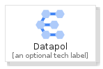
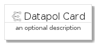
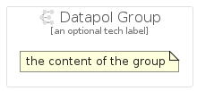

# Datapol


```text
gcp/Item/Datapol
```

```text
include('gcp/Item/Datapol')
```


| Illustration | Datapol | DatapolCard | DatapolGroup |
| :---: | :---: | :---: | :---: |
|  |  |  |  |


## Sprites
The item provides the following sriptes:

- `<$DatapolXs>`
- `<$DatapolSm>`
- `<$DatapolMd>`
- `<$DatapolLg>`


## Datapol

### Load remotely
```plantuml
@startuml
' configures the library
!global $LIB_BASE_LOCATION="https://raw.githubusercontent.com/tmorin/plantuml-libs/master/distribution"

' loads the library's bootstrap
!include $LIB_BASE_LOCATION/bootstrap.puml

' loads the package bootstrap
include('gcp/bootstrap')

' loads the Item which embeds the element Datapol
include('gcp/Item/Datapol')

' renders the element
Datapol('Datapol', 'Datapol', 'an optional tech label', 'an optional description')
@enduml
```

### Load locally
```plantuml
@startuml
' configures the library
!global $INCLUSION_MODE="local"
!global $LIB_BASE_LOCATION="../.."

' loads the library's bootstrap
!include $LIB_BASE_LOCATION/bootstrap.puml

' loads the package bootstrap
include('gcp/bootstrap')

' loads the Item which embeds the element Datapol
include('gcp/Item/Datapol')

' renders the element
Datapol('Datapol', 'Datapol', 'an optional tech label', 'an optional description')
@enduml
```

## DatapolCard

### Load remotely
```plantuml
@startuml
' configures the library
!global $LIB_BASE_LOCATION="https://raw.githubusercontent.com/tmorin/plantuml-libs/master/distribution"

' loads the library's bootstrap
!include $LIB_BASE_LOCATION/bootstrap.puml

' loads the package bootstrap
include('gcp/bootstrap')

' loads the Item which embeds the element DatapolCard
include('gcp/Item/Datapol')

' renders the element
DatapolCard('DatapolCard', 'Datapol Card', 'an optional description')
@enduml
```

### Load locally
```plantuml
@startuml
' configures the library
!global $INCLUSION_MODE="local"
!global $LIB_BASE_LOCATION="../.."

' loads the library's bootstrap
!include $LIB_BASE_LOCATION/bootstrap.puml

' loads the package bootstrap
include('gcp/bootstrap')

' loads the Item which embeds the element DatapolCard
include('gcp/Item/Datapol')

' renders the element
DatapolCard('DatapolCard', 'Datapol Card', 'an optional description')
@enduml
```

## DatapolGroup

### Load remotely
```plantuml
@startuml
' configures the library
!global $LIB_BASE_LOCATION="https://raw.githubusercontent.com/tmorin/plantuml-libs/master/distribution"

' loads the library's bootstrap
!include $LIB_BASE_LOCATION/bootstrap.puml

' loads the package bootstrap
include('gcp/bootstrap')

' loads the Item which embeds the element DatapolGroup
include('gcp/Item/Datapol')

' renders the element
DatapolGroup('DatapolGroup', 'Datapol Group', 'an optional tech label') {
    note as note
        the content of the group
    end note
}
@enduml
```

### Load locally
```plantuml
@startuml
' configures the library
!global $INCLUSION_MODE="local"
!global $LIB_BASE_LOCATION="../.."

' loads the library's bootstrap
!include $LIB_BASE_LOCATION/bootstrap.puml

' loads the package bootstrap
include('gcp/bootstrap')

' loads the Item which embeds the element DatapolGroup
include('gcp/Item/Datapol')

' renders the element
DatapolGroup('DatapolGroup', 'Datapol Group', 'an optional tech label') {
    note as note
        the content of the group
    end note
}
@enduml
```

