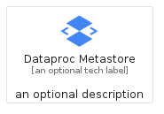
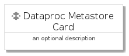
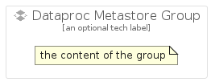

# DataprocMetastore


```text
gcp/Item/DataprocMetastore
```

```text
include('gcp/Item/DataprocMetastore')
```


| Illustration | DataprocMetastore | DataprocMetastoreCard | DataprocMetastoreGroup |
| :---: | :---: | :---: | :---: |
|  |  |  |  |


## Sprites
The item provides the following sriptes:

- `<$DataprocMetastoreXs>`
- `<$DataprocMetastoreSm>`
- `<$DataprocMetastoreMd>`
- `<$DataprocMetastoreLg>`


## DataprocMetastore

### Load remotely
```plantuml
@startuml
' configures the library
!global $LIB_BASE_LOCATION="https://raw.githubusercontent.com/tmorin/plantuml-libs/master/distribution"

' loads the library's bootstrap
!include $LIB_BASE_LOCATION/bootstrap.puml

' loads the package bootstrap
include('gcp/bootstrap')

' loads the Item which embeds the element DataprocMetastore
include('gcp/Item/DataprocMetastore')

' renders the element
DataprocMetastore('DataprocMetastore', 'Dataproc Metastore', 'an optional tech label', 'an optional description')
@enduml
```

### Load locally
```plantuml
@startuml
' configures the library
!global $INCLUSION_MODE="local"
!global $LIB_BASE_LOCATION="../.."

' loads the library's bootstrap
!include $LIB_BASE_LOCATION/bootstrap.puml

' loads the package bootstrap
include('gcp/bootstrap')

' loads the Item which embeds the element DataprocMetastore
include('gcp/Item/DataprocMetastore')

' renders the element
DataprocMetastore('DataprocMetastore', 'Dataproc Metastore', 'an optional tech label', 'an optional description')
@enduml
```

## DataprocMetastoreCard

### Load remotely
```plantuml
@startuml
' configures the library
!global $LIB_BASE_LOCATION="https://raw.githubusercontent.com/tmorin/plantuml-libs/master/distribution"

' loads the library's bootstrap
!include $LIB_BASE_LOCATION/bootstrap.puml

' loads the package bootstrap
include('gcp/bootstrap')

' loads the Item which embeds the element DataprocMetastoreCard
include('gcp/Item/DataprocMetastore')

' renders the element
DataprocMetastoreCard('DataprocMetastoreCard', 'Dataproc Metastore Card', 'an optional description')
@enduml
```

### Load locally
```plantuml
@startuml
' configures the library
!global $INCLUSION_MODE="local"
!global $LIB_BASE_LOCATION="../.."

' loads the library's bootstrap
!include $LIB_BASE_LOCATION/bootstrap.puml

' loads the package bootstrap
include('gcp/bootstrap')

' loads the Item which embeds the element DataprocMetastoreCard
include('gcp/Item/DataprocMetastore')

' renders the element
DataprocMetastoreCard('DataprocMetastoreCard', 'Dataproc Metastore Card', 'an optional description')
@enduml
```

## DataprocMetastoreGroup

### Load remotely
```plantuml
@startuml
' configures the library
!global $LIB_BASE_LOCATION="https://raw.githubusercontent.com/tmorin/plantuml-libs/master/distribution"

' loads the library's bootstrap
!include $LIB_BASE_LOCATION/bootstrap.puml

' loads the package bootstrap
include('gcp/bootstrap')

' loads the Item which embeds the element DataprocMetastoreGroup
include('gcp/Item/DataprocMetastore')

' renders the element
DataprocMetastoreGroup('DataprocMetastoreGroup', 'Dataproc Metastore Group', 'an optional tech label') {
    note as note
        the content of the group
    end note
}
@enduml
```

### Load locally
```plantuml
@startuml
' configures the library
!global $INCLUSION_MODE="local"
!global $LIB_BASE_LOCATION="../.."

' loads the library's bootstrap
!include $LIB_BASE_LOCATION/bootstrap.puml

' loads the package bootstrap
include('gcp/bootstrap')

' loads the Item which embeds the element DataprocMetastoreGroup
include('gcp/Item/DataprocMetastore')

' renders the element
DataprocMetastoreGroup('DataprocMetastoreGroup', 'Dataproc Metastore Group', 'an optional tech label') {
    note as note
        the content of the group
    end note
}
@enduml
```

