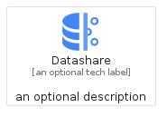
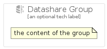

# Datashare


```text
gcp/Item/Datashare
```

```text
include('gcp/Item/Datashare')
```


| Illustration | Datashare | DatashareCard | DatashareGroup |
| :---: | :---: | :---: | :---: |
|  |  |  |  |


## Datashare

### Load remotely
```plantuml
@startuml
' configures the library
!global $LIB_BASE_LOCATION="https://raw.githubusercontent.com/tmorin/plantuml-libs/master/distribution"

' loads the library's bootstrap
!include $LIB_BASE_LOCATION/bootstrap.puml

' loads the package bootstrap
include('gcp/bootstrap')

' loads the Item which embeds the element Datashare
include('gcp/Item/Datashare')

' renders the element
Datashare('Datashare', 'Datashare', 'an optional tech label')
@enduml
```

### Load locally
```plantuml
@startuml
' configures the library
!global $INCLUSION_MODE="local"
!global $LIB_BASE_LOCATION="../.."

' loads the library's bootstrap
!include $LIB_BASE_LOCATION/bootstrap.puml

' loads the package bootstrap
include('gcp/bootstrap')

' loads the Item which embeds the element Datashare
include('gcp/Item/Datashare')

' renders the element
Datashare('Datashare', 'Datashare', 'an optional tech label')
@enduml
```

## DatashareCard

### Load remotely
```plantuml
@startuml
' configures the library
!global $LIB_BASE_LOCATION="https://raw.githubusercontent.com/tmorin/plantuml-libs/master/distribution"

' loads the library's bootstrap
!include $LIB_BASE_LOCATION/bootstrap.puml

' loads the package bootstrap
include('gcp/bootstrap')

' loads the Item which embeds the element DatashareCard
include('gcp/Item/Datashare')

' renders the element
DatashareCard('DatashareCard', 'Datashare Card', 'an optional description')
@enduml
```

### Load locally
```plantuml
@startuml
' configures the library
!global $INCLUSION_MODE="local"
!global $LIB_BASE_LOCATION="../.."

' loads the library's bootstrap
!include $LIB_BASE_LOCATION/bootstrap.puml

' loads the package bootstrap
include('gcp/bootstrap')

' loads the Item which embeds the element DatashareCard
include('gcp/Item/Datashare')

' renders the element
DatashareCard('DatashareCard', 'Datashare Card', 'an optional description')
@enduml
```

## DatashareGroup

### Load remotely
```plantuml
@startuml
' configures the library
!global $LIB_BASE_LOCATION="https://raw.githubusercontent.com/tmorin/plantuml-libs/master/distribution"

' loads the library's bootstrap
!include $LIB_BASE_LOCATION/bootstrap.puml

' loads the package bootstrap
include('gcp/bootstrap')

' loads the Item which embeds the element DatashareGroup
include('gcp/Item/Datashare')

' renders the element
DatashareGroup('DatashareGroup', 'Datashare Group', 'an optional tech label') {
    note as note
        the content of the group
    end note
}
@enduml
```

### Load locally
```plantuml
@startuml
' configures the library
!global $INCLUSION_MODE="local"
!global $LIB_BASE_LOCATION="../.."

' loads the library's bootstrap
!include $LIB_BASE_LOCATION/bootstrap.puml

' loads the package bootstrap
include('gcp/bootstrap')

' loads the Item which embeds the element DatashareGroup
include('gcp/Item/Datashare')

' renders the element
DatashareGroup('DatashareGroup', 'Datashare Group', 'an optional tech label') {
    note as note
        the content of the group
    end note
}
@enduml
```

