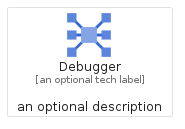
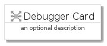

# Debugger


```text
gcp/Item/Debugger
```

```text
include('gcp/Item/Debugger')
```


| Illustration | Debugger | DebuggerCard | DebuggerGroup |
| :---: | :---: | :---: | :---: |
|  |  |  |  |


## Debugger

### Load remotely
```plantuml
@startuml
' configures the library
!global $LIB_BASE_LOCATION="https://raw.githubusercontent.com/tmorin/plantuml-libs/master/distribution"

' loads the library's bootstrap
!include $LIB_BASE_LOCATION/bootstrap.puml

' loads the package bootstrap
include('gcp/bootstrap')

' loads the Item which embeds the element Debugger
include('gcp/Item/Debugger')

' renders the element
Debugger('Debugger', 'Debugger', 'an optional tech label', 'an optional description')
@enduml
```

### Load locally
```plantuml
@startuml
' configures the library
!global $INCLUSION_MODE="local"
!global $LIB_BASE_LOCATION="../.."

' loads the library's bootstrap
!include $LIB_BASE_LOCATION/bootstrap.puml

' loads the package bootstrap
include('gcp/bootstrap')

' loads the Item which embeds the element Debugger
include('gcp/Item/Debugger')

' renders the element
Debugger('Debugger', 'Debugger', 'an optional tech label', 'an optional description')
@enduml
```

## DebuggerCard

### Load remotely
```plantuml
@startuml
' configures the library
!global $LIB_BASE_LOCATION="https://raw.githubusercontent.com/tmorin/plantuml-libs/master/distribution"

' loads the library's bootstrap
!include $LIB_BASE_LOCATION/bootstrap.puml

' loads the package bootstrap
include('gcp/bootstrap')

' loads the Item which embeds the element DebuggerCard
include('gcp/Item/Debugger')

' renders the element
DebuggerCard('DebuggerCard', 'Debugger Card', 'an optional description')
@enduml
```

### Load locally
```plantuml
@startuml
' configures the library
!global $INCLUSION_MODE="local"
!global $LIB_BASE_LOCATION="../.."

' loads the library's bootstrap
!include $LIB_BASE_LOCATION/bootstrap.puml

' loads the package bootstrap
include('gcp/bootstrap')

' loads the Item which embeds the element DebuggerCard
include('gcp/Item/Debugger')

' renders the element
DebuggerCard('DebuggerCard', 'Debugger Card', 'an optional description')
@enduml
```

## DebuggerGroup

### Load remotely
```plantuml
@startuml
' configures the library
!global $LIB_BASE_LOCATION="https://raw.githubusercontent.com/tmorin/plantuml-libs/master/distribution"

' loads the library's bootstrap
!include $LIB_BASE_LOCATION/bootstrap.puml

' loads the package bootstrap
include('gcp/bootstrap')

' loads the Item which embeds the element DebuggerGroup
include('gcp/Item/Debugger')

' renders the element
DebuggerGroup('DebuggerGroup', 'Debugger Group', 'an optional tech label') {
    note as note
        the content of the group
    end note
}
@enduml
```

### Load locally
```plantuml
@startuml
' configures the library
!global $INCLUSION_MODE="local"
!global $LIB_BASE_LOCATION="../.."

' loads the library's bootstrap
!include $LIB_BASE_LOCATION/bootstrap.puml

' loads the package bootstrap
include('gcp/bootstrap')

' loads the Item which embeds the element DebuggerGroup
include('gcp/Item/Debugger')

' renders the element
DebuggerGroup('DebuggerGroup', 'Debugger Group', 'an optional tech label') {
    note as note
        the content of the group
    end note
}
@enduml
```

