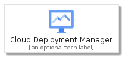
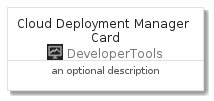
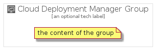

# CloudDeploymentManager


```text
gcp/Item/DeveloperTools/CloudDeploymentManager
```

```text
include('gcp/Item/DeveloperTools/CloudDeploymentManager')
```


| Illustration | CloudDeploymentManager | CloudDeploymentManagerCard | CloudDeploymentManagerGroup |
| :---: | :---: | :---: | :---: |
|  |  |  |  |


## CloudDeploymentManager

### Load remotely
```plantuml
@startuml
' configures the library
!global $LIB_BASE_LOCATION="https://raw.githubusercontent.com/tmorin/plantuml-libs/master/distribution"

' loads the library's bootstrap
!include $LIB_BASE_LOCATION/bootstrap.puml

' loads the package bootstrap
include('gcp/bootstrap')

' loads the Item which embeds the element CloudDeploymentManager
include('gcp/Item/DeveloperTools/CloudDeploymentManager')

' renders the element
CloudDeploymentManager('CloudDeploymentManager', 'Cloud Deployment Manager', 'an optional tech label')
@enduml
```

### Load locally
```plantuml
@startuml
' configures the library
!global $INCLUSION_MODE="local"
!global $LIB_BASE_LOCATION="../../.."

' loads the library's bootstrap
!include $LIB_BASE_LOCATION/bootstrap.puml

' loads the package bootstrap
include('gcp/bootstrap')

' loads the Item which embeds the element CloudDeploymentManager
include('gcp/Item/DeveloperTools/CloudDeploymentManager')

' renders the element
CloudDeploymentManager('CloudDeploymentManager', 'Cloud Deployment Manager', 'an optional tech label')
@enduml
```

## CloudDeploymentManagerCard

### Load remotely
```plantuml
@startuml
' configures the library
!global $LIB_BASE_LOCATION="https://raw.githubusercontent.com/tmorin/plantuml-libs/master/distribution"

' loads the library's bootstrap
!include $LIB_BASE_LOCATION/bootstrap.puml

' loads the package bootstrap
include('gcp/bootstrap')

' loads the Item which embeds the element CloudDeploymentManagerCard
include('gcp/Item/DeveloperTools/CloudDeploymentManager')

' renders the element
CloudDeploymentManagerCard('CloudDeploymentManagerCard', 'Cloud Deployment Manager Card', 'an optional description')
@enduml
```

### Load locally
```plantuml
@startuml
' configures the library
!global $INCLUSION_MODE="local"
!global $LIB_BASE_LOCATION="../../.."

' loads the library's bootstrap
!include $LIB_BASE_LOCATION/bootstrap.puml

' loads the package bootstrap
include('gcp/bootstrap')

' loads the Item which embeds the element CloudDeploymentManagerCard
include('gcp/Item/DeveloperTools/CloudDeploymentManager')

' renders the element
CloudDeploymentManagerCard('CloudDeploymentManagerCard', 'Cloud Deployment Manager Card', 'an optional description')
@enduml
```

## CloudDeploymentManagerGroup

### Load remotely
```plantuml
@startuml
' configures the library
!global $LIB_BASE_LOCATION="https://raw.githubusercontent.com/tmorin/plantuml-libs/master/distribution"

' loads the library's bootstrap
!include $LIB_BASE_LOCATION/bootstrap.puml

' loads the package bootstrap
include('gcp/bootstrap')

' loads the Item which embeds the element CloudDeploymentManagerGroup
include('gcp/Item/DeveloperTools/CloudDeploymentManager')

' renders the element
CloudDeploymentManagerGroup('CloudDeploymentManagerGroup', 'Cloud Deployment Manager Group', 'an optional tech label') {
    note as note
        the content of the group
    end note
}
@enduml
```

### Load locally
```plantuml
@startuml
' configures the library
!global $INCLUSION_MODE="local"
!global $LIB_BASE_LOCATION="../../.."

' loads the library's bootstrap
!include $LIB_BASE_LOCATION/bootstrap.puml

' loads the package bootstrap
include('gcp/bootstrap')

' loads the Item which embeds the element CloudDeploymentManagerGroup
include('gcp/Item/DeveloperTools/CloudDeploymentManager')

' renders the element
CloudDeploymentManagerGroup('CloudDeploymentManagerGroup', 'Cloud Deployment Manager Group', 'an optional tech label') {
    note as note
        the content of the group
    end note
}
@enduml
```

