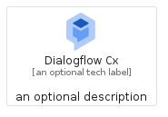
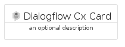
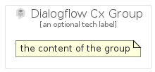

# DialogflowCx


```text
gcp/Item/DialogflowCx
```

```text
include('gcp/Item/DialogflowCx')
```


| Illustration | DialogflowCx | DialogflowCxCard | DialogflowCxGroup |
| :---: | :---: | :---: | :---: |
|  |  |  |  |


## DialogflowCx

### Load remotely
```plantuml
@startuml
' configures the library
!global $LIB_BASE_LOCATION="https://raw.githubusercontent.com/tmorin/plantuml-libs/master/distribution"

' loads the library's bootstrap
!include $LIB_BASE_LOCATION/bootstrap.puml

' loads the package bootstrap
include('gcp/bootstrap')

' loads the Item which embeds the element DialogflowCx
include('gcp/Item/DialogflowCx')

' renders the element
DialogflowCx('DialogflowCx', 'Dialogflow Cx', 'an optional tech label', 'an optional description')
@enduml
```

### Load locally
```plantuml
@startuml
' configures the library
!global $INCLUSION_MODE="local"
!global $LIB_BASE_LOCATION="../.."

' loads the library's bootstrap
!include $LIB_BASE_LOCATION/bootstrap.puml

' loads the package bootstrap
include('gcp/bootstrap')

' loads the Item which embeds the element DialogflowCx
include('gcp/Item/DialogflowCx')

' renders the element
DialogflowCx('DialogflowCx', 'Dialogflow Cx', 'an optional tech label', 'an optional description')
@enduml
```

## DialogflowCxCard

### Load remotely
```plantuml
@startuml
' configures the library
!global $LIB_BASE_LOCATION="https://raw.githubusercontent.com/tmorin/plantuml-libs/master/distribution"

' loads the library's bootstrap
!include $LIB_BASE_LOCATION/bootstrap.puml

' loads the package bootstrap
include('gcp/bootstrap')

' loads the Item which embeds the element DialogflowCxCard
include('gcp/Item/DialogflowCx')

' renders the element
DialogflowCxCard('DialogflowCxCard', 'Dialogflow Cx Card', 'an optional description')
@enduml
```

### Load locally
```plantuml
@startuml
' configures the library
!global $INCLUSION_MODE="local"
!global $LIB_BASE_LOCATION="../.."

' loads the library's bootstrap
!include $LIB_BASE_LOCATION/bootstrap.puml

' loads the package bootstrap
include('gcp/bootstrap')

' loads the Item which embeds the element DialogflowCxCard
include('gcp/Item/DialogflowCx')

' renders the element
DialogflowCxCard('DialogflowCxCard', 'Dialogflow Cx Card', 'an optional description')
@enduml
```

## DialogflowCxGroup

### Load remotely
```plantuml
@startuml
' configures the library
!global $LIB_BASE_LOCATION="https://raw.githubusercontent.com/tmorin/plantuml-libs/master/distribution"

' loads the library's bootstrap
!include $LIB_BASE_LOCATION/bootstrap.puml

' loads the package bootstrap
include('gcp/bootstrap')

' loads the Item which embeds the element DialogflowCxGroup
include('gcp/Item/DialogflowCx')

' renders the element
DialogflowCxGroup('DialogflowCxGroup', 'Dialogflow Cx Group', 'an optional tech label') {
    note as note
        the content of the group
    end note
}
@enduml
```

### Load locally
```plantuml
@startuml
' configures the library
!global $INCLUSION_MODE="local"
!global $LIB_BASE_LOCATION="../.."

' loads the library's bootstrap
!include $LIB_BASE_LOCATION/bootstrap.puml

' loads the package bootstrap
include('gcp/bootstrap')

' loads the Item which embeds the element DialogflowCxGroup
include('gcp/Item/DialogflowCx')

' renders the element
DialogflowCxGroup('DialogflowCxGroup', 'Dialogflow Cx Group', 'an optional tech label') {
    note as note
        the content of the group
    end note
}
@enduml
```

