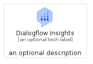
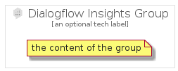

# DialogflowInsights


```text
gcp/Item/DialogflowInsights
```

```text
include('gcp/Item/DialogflowInsights')
```


| Illustration | DialogflowInsights | DialogflowInsightsCard | DialogflowInsightsGroup |
| :---: | :---: | :---: | :---: |
|  |  |  |  |


## Sprites
The item provides the following sriptes:

- `<$DialogflowInsightsXs>`
- `<$DialogflowInsightsSm>`
- `<$DialogflowInsightsMd>`
- `<$DialogflowInsightsLg>`


## DialogflowInsights

### Load remotely
```plantuml
@startuml
' configures the library
!global $LIB_BASE_LOCATION="https://raw.githubusercontent.com/tmorin/plantuml-libs/master/distribution"

' loads the library's bootstrap
!include $LIB_BASE_LOCATION/bootstrap.puml

' loads the package bootstrap
include('gcp/bootstrap')

' loads the Item which embeds the element DialogflowInsights
include('gcp/Item/DialogflowInsights')

' renders the element
DialogflowInsights('DialogflowInsights', 'Dialogflow Insights', 'an optional tech label', 'an optional description')
@enduml
```

### Load locally
```plantuml
@startuml
' configures the library
!global $INCLUSION_MODE="local"
!global $LIB_BASE_LOCATION="../.."

' loads the library's bootstrap
!include $LIB_BASE_LOCATION/bootstrap.puml

' loads the package bootstrap
include('gcp/bootstrap')

' loads the Item which embeds the element DialogflowInsights
include('gcp/Item/DialogflowInsights')

' renders the element
DialogflowInsights('DialogflowInsights', 'Dialogflow Insights', 'an optional tech label', 'an optional description')
@enduml
```

## DialogflowInsightsCard

### Load remotely
```plantuml
@startuml
' configures the library
!global $LIB_BASE_LOCATION="https://raw.githubusercontent.com/tmorin/plantuml-libs/master/distribution"

' loads the library's bootstrap
!include $LIB_BASE_LOCATION/bootstrap.puml

' loads the package bootstrap
include('gcp/bootstrap')

' loads the Item which embeds the element DialogflowInsightsCard
include('gcp/Item/DialogflowInsights')

' renders the element
DialogflowInsightsCard('DialogflowInsightsCard', 'Dialogflow Insights Card', 'an optional description')
@enduml
```

### Load locally
```plantuml
@startuml
' configures the library
!global $INCLUSION_MODE="local"
!global $LIB_BASE_LOCATION="../.."

' loads the library's bootstrap
!include $LIB_BASE_LOCATION/bootstrap.puml

' loads the package bootstrap
include('gcp/bootstrap')

' loads the Item which embeds the element DialogflowInsightsCard
include('gcp/Item/DialogflowInsights')

' renders the element
DialogflowInsightsCard('DialogflowInsightsCard', 'Dialogflow Insights Card', 'an optional description')
@enduml
```

## DialogflowInsightsGroup

### Load remotely
```plantuml
@startuml
' configures the library
!global $LIB_BASE_LOCATION="https://raw.githubusercontent.com/tmorin/plantuml-libs/master/distribution"

' loads the library's bootstrap
!include $LIB_BASE_LOCATION/bootstrap.puml

' loads the package bootstrap
include('gcp/bootstrap')

' loads the Item which embeds the element DialogflowInsightsGroup
include('gcp/Item/DialogflowInsights')

' renders the element
DialogflowInsightsGroup('DialogflowInsightsGroup', 'Dialogflow Insights Group', 'an optional tech label') {
    note as note
        the content of the group
    end note
}
@enduml
```

### Load locally
```plantuml
@startuml
' configures the library
!global $INCLUSION_MODE="local"
!global $LIB_BASE_LOCATION="../.."

' loads the library's bootstrap
!include $LIB_BASE_LOCATION/bootstrap.puml

' loads the package bootstrap
include('gcp/bootstrap')

' loads the Item which embeds the element DialogflowInsightsGroup
include('gcp/Item/DialogflowInsights')

' renders the element
DialogflowInsightsGroup('DialogflowInsightsGroup', 'Dialogflow Insights Group', 'an optional tech label') {
    note as note
        the content of the group
    end note
}
@enduml
```

