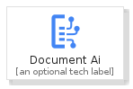
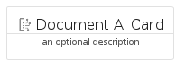
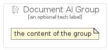

# DocumentAi


```text
gcp/Item/DocumentAi
```

```text
include('gcp/Item/DocumentAi')
```


| Illustration | DocumentAi | DocumentAiCard | DocumentAiGroup |
| :---: | :---: | :---: | :---: |
|  |  |  |  |


## DocumentAi

### Load remotely
```plantuml
@startuml
' configures the library
!global $LIB_BASE_LOCATION="https://raw.githubusercontent.com/tmorin/plantuml-libs/master/distribution"

' loads the library's bootstrap
!include $LIB_BASE_LOCATION/bootstrap.puml

' loads the package bootstrap
include('gcp/bootstrap')

' loads the Item which embeds the element DocumentAi
include('gcp/Item/DocumentAi')

' renders the element
DocumentAi('DocumentAi', 'Document Ai', 'an optional tech label')
@enduml
```

### Load locally
```plantuml
@startuml
' configures the library
!global $INCLUSION_MODE="local"
!global $LIB_BASE_LOCATION="../.."

' loads the library's bootstrap
!include $LIB_BASE_LOCATION/bootstrap.puml

' loads the package bootstrap
include('gcp/bootstrap')

' loads the Item which embeds the element DocumentAi
include('gcp/Item/DocumentAi')

' renders the element
DocumentAi('DocumentAi', 'Document Ai', 'an optional tech label')
@enduml
```

## DocumentAiCard

### Load remotely
```plantuml
@startuml
' configures the library
!global $LIB_BASE_LOCATION="https://raw.githubusercontent.com/tmorin/plantuml-libs/master/distribution"

' loads the library's bootstrap
!include $LIB_BASE_LOCATION/bootstrap.puml

' loads the package bootstrap
include('gcp/bootstrap')

' loads the Item which embeds the element DocumentAiCard
include('gcp/Item/DocumentAi')

' renders the element
DocumentAiCard('DocumentAiCard', 'Document Ai Card', 'an optional description')
@enduml
```

### Load locally
```plantuml
@startuml
' configures the library
!global $INCLUSION_MODE="local"
!global $LIB_BASE_LOCATION="../.."

' loads the library's bootstrap
!include $LIB_BASE_LOCATION/bootstrap.puml

' loads the package bootstrap
include('gcp/bootstrap')

' loads the Item which embeds the element DocumentAiCard
include('gcp/Item/DocumentAi')

' renders the element
DocumentAiCard('DocumentAiCard', 'Document Ai Card', 'an optional description')
@enduml
```

## DocumentAiGroup

### Load remotely
```plantuml
@startuml
' configures the library
!global $LIB_BASE_LOCATION="https://raw.githubusercontent.com/tmorin/plantuml-libs/master/distribution"

' loads the library's bootstrap
!include $LIB_BASE_LOCATION/bootstrap.puml

' loads the package bootstrap
include('gcp/bootstrap')

' loads the Item which embeds the element DocumentAiGroup
include('gcp/Item/DocumentAi')

' renders the element
DocumentAiGroup('DocumentAiGroup', 'Document Ai Group', 'an optional tech label') {
    note as note
        the content of the group
    end note
}
@enduml
```

### Load locally
```plantuml
@startuml
' configures the library
!global $INCLUSION_MODE="local"
!global $LIB_BASE_LOCATION="../.."

' loads the library's bootstrap
!include $LIB_BASE_LOCATION/bootstrap.puml

' loads the package bootstrap
include('gcp/bootstrap')

' loads the Item which embeds the element DocumentAiGroup
include('gcp/Item/DocumentAi')

' renders the element
DocumentAiGroup('DocumentAiGroup', 'Document Ai Group', 'an optional tech label') {
    note as note
        the content of the group
    end note
}
@enduml
```

