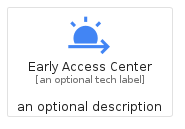
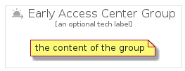

# EarlyAccessCenter


```text
gcp/Item/EarlyAccessCenter
```

```text
include('gcp/Item/EarlyAccessCenter')
```


| Illustration | EarlyAccessCenter | EarlyAccessCenterCard | EarlyAccessCenterGroup |
| :---: | :---: | :---: | :---: |
|  |  |  |  |


## EarlyAccessCenter

### Load remotely
```plantuml
@startuml
' configures the library
!global $LIB_BASE_LOCATION="https://raw.githubusercontent.com/tmorin/plantuml-libs/master/distribution"

' loads the library's bootstrap
!include $LIB_BASE_LOCATION/bootstrap.puml

' loads the package bootstrap
include('gcp/bootstrap')

' loads the Item which embeds the element EarlyAccessCenter
include('gcp/Item/EarlyAccessCenter')

' renders the element
EarlyAccessCenter('EarlyAccessCenter', 'Early Access Center', 'an optional tech label', 'an optional description')
@enduml
```

### Load locally
```plantuml
@startuml
' configures the library
!global $INCLUSION_MODE="local"
!global $LIB_BASE_LOCATION="../.."

' loads the library's bootstrap
!include $LIB_BASE_LOCATION/bootstrap.puml

' loads the package bootstrap
include('gcp/bootstrap')

' loads the Item which embeds the element EarlyAccessCenter
include('gcp/Item/EarlyAccessCenter')

' renders the element
EarlyAccessCenter('EarlyAccessCenter', 'Early Access Center', 'an optional tech label', 'an optional description')
@enduml
```

## EarlyAccessCenterCard

### Load remotely
```plantuml
@startuml
' configures the library
!global $LIB_BASE_LOCATION="https://raw.githubusercontent.com/tmorin/plantuml-libs/master/distribution"

' loads the library's bootstrap
!include $LIB_BASE_LOCATION/bootstrap.puml

' loads the package bootstrap
include('gcp/bootstrap')

' loads the Item which embeds the element EarlyAccessCenterCard
include('gcp/Item/EarlyAccessCenter')

' renders the element
EarlyAccessCenterCard('EarlyAccessCenterCard', 'Early Access Center Card', 'an optional description')
@enduml
```

### Load locally
```plantuml
@startuml
' configures the library
!global $INCLUSION_MODE="local"
!global $LIB_BASE_LOCATION="../.."

' loads the library's bootstrap
!include $LIB_BASE_LOCATION/bootstrap.puml

' loads the package bootstrap
include('gcp/bootstrap')

' loads the Item which embeds the element EarlyAccessCenterCard
include('gcp/Item/EarlyAccessCenter')

' renders the element
EarlyAccessCenterCard('EarlyAccessCenterCard', 'Early Access Center Card', 'an optional description')
@enduml
```

## EarlyAccessCenterGroup

### Load remotely
```plantuml
@startuml
' configures the library
!global $LIB_BASE_LOCATION="https://raw.githubusercontent.com/tmorin/plantuml-libs/master/distribution"

' loads the library's bootstrap
!include $LIB_BASE_LOCATION/bootstrap.puml

' loads the package bootstrap
include('gcp/bootstrap')

' loads the Item which embeds the element EarlyAccessCenterGroup
include('gcp/Item/EarlyAccessCenter')

' renders the element
EarlyAccessCenterGroup('EarlyAccessCenterGroup', 'Early Access Center Group', 'an optional tech label') {
    note as note
        the content of the group
    end note
}
@enduml
```

### Load locally
```plantuml
@startuml
' configures the library
!global $INCLUSION_MODE="local"
!global $LIB_BASE_LOCATION="../.."

' loads the library's bootstrap
!include $LIB_BASE_LOCATION/bootstrap.puml

' loads the package bootstrap
include('gcp/bootstrap')

' loads the Item which embeds the element EarlyAccessCenterGroup
include('gcp/Item/EarlyAccessCenter')

' renders the element
EarlyAccessCenterGroup('EarlyAccessCenterGroup', 'Early Access Center Group', 'an optional tech label') {
    note as note
        the content of the group
    end note
}
@enduml
```

