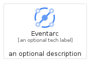
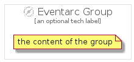

# Eventarc


```text
gcp/Item/Eventarc
```

```text
include('gcp/Item/Eventarc')
```


| Illustration | Eventarc | EventarcCard | EventarcGroup |
| :---: | :---: | :---: | :---: |
|  |  |  |  |


## Sprites
The item provides the following sriptes:

- `<$EventarcXs>`
- `<$EventarcSm>`
- `<$EventarcMd>`
- `<$EventarcLg>`


## Eventarc

### Load remotely
```plantuml
@startuml
' configures the library
!global $LIB_BASE_LOCATION="https://raw.githubusercontent.com/tmorin/plantuml-libs/master/distribution"

' loads the library's bootstrap
!include $LIB_BASE_LOCATION/bootstrap.puml

' loads the package bootstrap
include('gcp/bootstrap')

' loads the Item which embeds the element Eventarc
include('gcp/Item/Eventarc')

' renders the element
Eventarc('Eventarc', 'Eventarc', 'an optional tech label', 'an optional description')
@enduml
```

### Load locally
```plantuml
@startuml
' configures the library
!global $INCLUSION_MODE="local"
!global $LIB_BASE_LOCATION="../.."

' loads the library's bootstrap
!include $LIB_BASE_LOCATION/bootstrap.puml

' loads the package bootstrap
include('gcp/bootstrap')

' loads the Item which embeds the element Eventarc
include('gcp/Item/Eventarc')

' renders the element
Eventarc('Eventarc', 'Eventarc', 'an optional tech label', 'an optional description')
@enduml
```

## EventarcCard

### Load remotely
```plantuml
@startuml
' configures the library
!global $LIB_BASE_LOCATION="https://raw.githubusercontent.com/tmorin/plantuml-libs/master/distribution"

' loads the library's bootstrap
!include $LIB_BASE_LOCATION/bootstrap.puml

' loads the package bootstrap
include('gcp/bootstrap')

' loads the Item which embeds the element EventarcCard
include('gcp/Item/Eventarc')

' renders the element
EventarcCard('EventarcCard', 'Eventarc Card', 'an optional description')
@enduml
```

### Load locally
```plantuml
@startuml
' configures the library
!global $INCLUSION_MODE="local"
!global $LIB_BASE_LOCATION="../.."

' loads the library's bootstrap
!include $LIB_BASE_LOCATION/bootstrap.puml

' loads the package bootstrap
include('gcp/bootstrap')

' loads the Item which embeds the element EventarcCard
include('gcp/Item/Eventarc')

' renders the element
EventarcCard('EventarcCard', 'Eventarc Card', 'an optional description')
@enduml
```

## EventarcGroup

### Load remotely
```plantuml
@startuml
' configures the library
!global $LIB_BASE_LOCATION="https://raw.githubusercontent.com/tmorin/plantuml-libs/master/distribution"

' loads the library's bootstrap
!include $LIB_BASE_LOCATION/bootstrap.puml

' loads the package bootstrap
include('gcp/bootstrap')

' loads the Item which embeds the element EventarcGroup
include('gcp/Item/Eventarc')

' renders the element
EventarcGroup('EventarcGroup', 'Eventarc Group', 'an optional tech label') {
    note as note
        the content of the group
    end note
}
@enduml
```

### Load locally
```plantuml
@startuml
' configures the library
!global $INCLUSION_MODE="local"
!global $LIB_BASE_LOCATION="../.."

' loads the library's bootstrap
!include $LIB_BASE_LOCATION/bootstrap.puml

' loads the package bootstrap
include('gcp/bootstrap')

' loads the Item which embeds the element EventarcGroup
include('gcp/Item/Eventarc')

' renders the element
EventarcGroup('EventarcGroup', 'Eventarc Group', 'an optional tech label') {
    note as note
        the content of the group
    end note
}
@enduml
```

