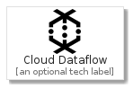
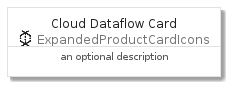
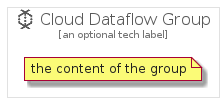

# CloudDataflow


```text
gcp/Item/ExpandedProductCardIcons/CloudDataflow
```

```text
include('gcp/Item/ExpandedProductCardIcons/CloudDataflow')
```


| Illustration | CloudDataflow | CloudDataflowCard | CloudDataflowGroup |
| :---: | :---: | :---: | :---: |
|  |  |  |  |


## CloudDataflow

### Load remotely
```plantuml
@startuml
' configures the library
!global $LIB_BASE_LOCATION="https://github.com/tmorin/plantuml-libs/distribution"

' loads the library's bootstrap
!include $LIB_BASE_LOCATION/bootstrap.puml

' loads the package bootstrap
include('gcp/bootstrap')

' loads the Item which embeds the element CloudDataflow
include('gcp/Item/ExpandedProductCardIcons/CloudDataflow')

' renders the element
CloudDataflow('CloudDataflow', 'Cloud Dataflow', 'an optional tech label')
@enduml
```

### Load locally
```plantuml
@startuml
' configures the library
!global $INCLUSION_MODE="local"
!global $LIB_BASE_LOCATION="../../.."

' loads the library's bootstrap
!include $LIB_BASE_LOCATION/bootstrap.puml

' loads the package bootstrap
include('gcp/bootstrap')

' loads the Item which embeds the element CloudDataflow
include('gcp/Item/ExpandedProductCardIcons/CloudDataflow')

' renders the element
CloudDataflow('CloudDataflow', 'Cloud Dataflow', 'an optional tech label')
@enduml
```

## CloudDataflowCard

### Load remotely
```plantuml
@startuml
' configures the library
!global $LIB_BASE_LOCATION="https://github.com/tmorin/plantuml-libs/distribution"

' loads the library's bootstrap
!include $LIB_BASE_LOCATION/bootstrap.puml

' loads the package bootstrap
include('gcp/bootstrap')

' loads the Item which embeds the element CloudDataflowCard
include('gcp/Item/ExpandedProductCardIcons/CloudDataflow')

' renders the element
CloudDataflowCard('CloudDataflowCard', 'Cloud Dataflow Card', 'an optional description')
@enduml
```

### Load locally
```plantuml
@startuml
' configures the library
!global $INCLUSION_MODE="local"
!global $LIB_BASE_LOCATION="../../.."

' loads the library's bootstrap
!include $LIB_BASE_LOCATION/bootstrap.puml

' loads the package bootstrap
include('gcp/bootstrap')

' loads the Item which embeds the element CloudDataflowCard
include('gcp/Item/ExpandedProductCardIcons/CloudDataflow')

' renders the element
CloudDataflowCard('CloudDataflowCard', 'Cloud Dataflow Card', 'an optional description')
@enduml
```

## CloudDataflowGroup

### Load remotely
```plantuml
@startuml
' configures the library
!global $LIB_BASE_LOCATION="https://github.com/tmorin/plantuml-libs/distribution"

' loads the library's bootstrap
!include $LIB_BASE_LOCATION/bootstrap.puml

' loads the package bootstrap
include('gcp/bootstrap')

' loads the Item which embeds the element CloudDataflowGroup
include('gcp/Item/ExpandedProductCardIcons/CloudDataflow')

' renders the element
CloudDataflowGroup('CloudDataflowGroup', 'Cloud Dataflow Group', 'an optional tech label') {
    note as note
        the content of the group
    end note
}
@enduml
```

### Load locally
```plantuml
@startuml
' configures the library
!global $INCLUSION_MODE="local"
!global $LIB_BASE_LOCATION="../../.."

' loads the library's bootstrap
!include $LIB_BASE_LOCATION/bootstrap.puml

' loads the package bootstrap
include('gcp/bootstrap')

' loads the Item which embeds the element CloudDataflowGroup
include('gcp/Item/ExpandedProductCardIcons/CloudDataflow')

' renders the element
CloudDataflowGroup('CloudDataflowGroup', 'Cloud Dataflow Group', 'an optional tech label') {
    note as note
        the content of the group
    end note
}
@enduml
```

