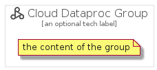

# CloudDataproc


```text
gcp/Item/ExpandedProductCardIcons/CloudDataproc
```

```text
include('gcp/Item/ExpandedProductCardIcons/CloudDataproc')
```


| Illustration | CloudDataproc | CloudDataprocCard | CloudDataprocGroup |
| :---: | :---: | :---: | :---: |
|  |  |  |  |


## CloudDataproc

### Load remotely
```plantuml
@startuml
' configures the library
!global $LIB_BASE_LOCATION="https://github.com/tmorin/plantuml-libs/distribution"

' loads the library's bootstrap
!include $LIB_BASE_LOCATION/bootstrap.puml

' loads the package bootstrap
include('gcp/bootstrap')

' loads the Item which embeds the element CloudDataproc
include('gcp/Item/ExpandedProductCardIcons/CloudDataproc')

' renders the element
CloudDataproc('CloudDataproc', 'Cloud Dataproc', 'an optional tech label')
@enduml
```

### Load locally
```plantuml
@startuml
' configures the library
!global $INCLUSION_MODE="local"
!global $LIB_BASE_LOCATION="../../.."

' loads the library's bootstrap
!include $LIB_BASE_LOCATION/bootstrap.puml

' loads the package bootstrap
include('gcp/bootstrap')

' loads the Item which embeds the element CloudDataproc
include('gcp/Item/ExpandedProductCardIcons/CloudDataproc')

' renders the element
CloudDataproc('CloudDataproc', 'Cloud Dataproc', 'an optional tech label')
@enduml
```

## CloudDataprocCard

### Load remotely
```plantuml
@startuml
' configures the library
!global $LIB_BASE_LOCATION="https://github.com/tmorin/plantuml-libs/distribution"

' loads the library's bootstrap
!include $LIB_BASE_LOCATION/bootstrap.puml

' loads the package bootstrap
include('gcp/bootstrap')

' loads the Item which embeds the element CloudDataprocCard
include('gcp/Item/ExpandedProductCardIcons/CloudDataproc')

' renders the element
CloudDataprocCard('CloudDataprocCard', 'Cloud Dataproc Card', 'an optional description')
@enduml
```

### Load locally
```plantuml
@startuml
' configures the library
!global $INCLUSION_MODE="local"
!global $LIB_BASE_LOCATION="../../.."

' loads the library's bootstrap
!include $LIB_BASE_LOCATION/bootstrap.puml

' loads the package bootstrap
include('gcp/bootstrap')

' loads the Item which embeds the element CloudDataprocCard
include('gcp/Item/ExpandedProductCardIcons/CloudDataproc')

' renders the element
CloudDataprocCard('CloudDataprocCard', 'Cloud Dataproc Card', 'an optional description')
@enduml
```

## CloudDataprocGroup

### Load remotely
```plantuml
@startuml
' configures the library
!global $LIB_BASE_LOCATION="https://github.com/tmorin/plantuml-libs/distribution"

' loads the library's bootstrap
!include $LIB_BASE_LOCATION/bootstrap.puml

' loads the package bootstrap
include('gcp/bootstrap')

' loads the Item which embeds the element CloudDataprocGroup
include('gcp/Item/ExpandedProductCardIcons/CloudDataproc')

' renders the element
CloudDataprocGroup('CloudDataprocGroup', 'Cloud Dataproc Group', 'an optional tech label') {
    note as note
        the content of the group
    end note
}
@enduml
```

### Load locally
```plantuml
@startuml
' configures the library
!global $INCLUSION_MODE="local"
!global $LIB_BASE_LOCATION="../../.."

' loads the library's bootstrap
!include $LIB_BASE_LOCATION/bootstrap.puml

' loads the package bootstrap
include('gcp/bootstrap')

' loads the Item which embeds the element CloudDataprocGroup
include('gcp/Item/ExpandedProductCardIcons/CloudDataproc')

' renders the element
CloudDataprocGroup('CloudDataprocGroup', 'Cloud Dataproc Group', 'an optional tech label') {
    note as note
        the content of the group
    end note
}
@enduml
```

