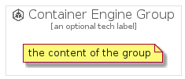

# ContainerEngine


```text
gcp/Item/ExpandedProductCardIcons/ContainerEngine
```

```text
include('gcp/Item/ExpandedProductCardIcons/ContainerEngine')
```


| Illustration | ContainerEngine | ContainerEngineCard | ContainerEngineGroup |
| :---: | :---: | :---: | :---: |
|  |  |  |  |


## ContainerEngine

### Load remotely
```plantuml
@startuml
' configures the library
!global $LIB_BASE_LOCATION="https://github.com/tmorin/plantuml-libs/distribution"

' loads the library's bootstrap
!include $LIB_BASE_LOCATION/bootstrap.puml

' loads the package bootstrap
include('gcp/bootstrap')

' loads the Item which embeds the element ContainerEngine
include('gcp/Item/ExpandedProductCardIcons/ContainerEngine')

' renders the element
ContainerEngine('ContainerEngine', 'Container Engine', 'an optional tech label')
@enduml
```

### Load locally
```plantuml
@startuml
' configures the library
!global $INCLUSION_MODE="local"
!global $LIB_BASE_LOCATION="../../.."

' loads the library's bootstrap
!include $LIB_BASE_LOCATION/bootstrap.puml

' loads the package bootstrap
include('gcp/bootstrap')

' loads the Item which embeds the element ContainerEngine
include('gcp/Item/ExpandedProductCardIcons/ContainerEngine')

' renders the element
ContainerEngine('ContainerEngine', 'Container Engine', 'an optional tech label')
@enduml
```

## ContainerEngineCard

### Load remotely
```plantuml
@startuml
' configures the library
!global $LIB_BASE_LOCATION="https://github.com/tmorin/plantuml-libs/distribution"

' loads the library's bootstrap
!include $LIB_BASE_LOCATION/bootstrap.puml

' loads the package bootstrap
include('gcp/bootstrap')

' loads the Item which embeds the element ContainerEngineCard
include('gcp/Item/ExpandedProductCardIcons/ContainerEngine')

' renders the element
ContainerEngineCard('ContainerEngineCard', 'Container Engine Card', 'an optional description')
@enduml
```

### Load locally
```plantuml
@startuml
' configures the library
!global $INCLUSION_MODE="local"
!global $LIB_BASE_LOCATION="../../.."

' loads the library's bootstrap
!include $LIB_BASE_LOCATION/bootstrap.puml

' loads the package bootstrap
include('gcp/bootstrap')

' loads the Item which embeds the element ContainerEngineCard
include('gcp/Item/ExpandedProductCardIcons/ContainerEngine')

' renders the element
ContainerEngineCard('ContainerEngineCard', 'Container Engine Card', 'an optional description')
@enduml
```

## ContainerEngineGroup

### Load remotely
```plantuml
@startuml
' configures the library
!global $LIB_BASE_LOCATION="https://github.com/tmorin/plantuml-libs/distribution"

' loads the library's bootstrap
!include $LIB_BASE_LOCATION/bootstrap.puml

' loads the package bootstrap
include('gcp/bootstrap')

' loads the Item which embeds the element ContainerEngineGroup
include('gcp/Item/ExpandedProductCardIcons/ContainerEngine')

' renders the element
ContainerEngineGroup('ContainerEngineGroup', 'Container Engine Group', 'an optional tech label') {
    note as note
        the content of the group
    end note
}
@enduml
```

### Load locally
```plantuml
@startuml
' configures the library
!global $INCLUSION_MODE="local"
!global $LIB_BASE_LOCATION="../../.."

' loads the library's bootstrap
!include $LIB_BASE_LOCATION/bootstrap.puml

' loads the package bootstrap
include('gcp/bootstrap')

' loads the Item which embeds the element ContainerEngineGroup
include('gcp/Item/ExpandedProductCardIcons/ContainerEngine')

' renders the element
ContainerEngineGroup('ContainerEngineGroup', 'Container Engine Group', 'an optional tech label') {
    note as note
        the content of the group
    end note
}
@enduml
```

