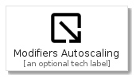
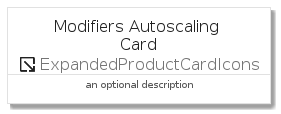
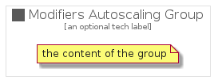

# ModifiersAutoscaling


```text
gcp/Item/ExpandedProductCardIcons/ModifiersAutoscaling
```

```text
include('gcp/Item/ExpandedProductCardIcons/ModifiersAutoscaling')
```


| Illustration | ModifiersAutoscaling | ModifiersAutoscalingCard | ModifiersAutoscalingGroup |
| :---: | :---: | :---: | :---: |
|  |  |  |  |


## ModifiersAutoscaling

### Load remotely
```plantuml
@startuml
' configures the library
!global $LIB_BASE_LOCATION="https://raw.githubusercontent.com/tmorin/plantuml-libs/master/distribution"

' loads the library's bootstrap
!include $LIB_BASE_LOCATION/bootstrap.puml

' loads the package bootstrap
include('gcp/bootstrap')

' loads the Item which embeds the element ModifiersAutoscaling
include('gcp/Item/ExpandedProductCardIcons/ModifiersAutoscaling')

' renders the element
ModifiersAutoscaling('ModifiersAutoscaling', 'Modifiers Autoscaling', 'an optional tech label')
@enduml
```

### Load locally
```plantuml
@startuml
' configures the library
!global $INCLUSION_MODE="local"
!global $LIB_BASE_LOCATION="../../.."

' loads the library's bootstrap
!include $LIB_BASE_LOCATION/bootstrap.puml

' loads the package bootstrap
include('gcp/bootstrap')

' loads the Item which embeds the element ModifiersAutoscaling
include('gcp/Item/ExpandedProductCardIcons/ModifiersAutoscaling')

' renders the element
ModifiersAutoscaling('ModifiersAutoscaling', 'Modifiers Autoscaling', 'an optional tech label')
@enduml
```

## ModifiersAutoscalingCard

### Load remotely
```plantuml
@startuml
' configures the library
!global $LIB_BASE_LOCATION="https://raw.githubusercontent.com/tmorin/plantuml-libs/master/distribution"

' loads the library's bootstrap
!include $LIB_BASE_LOCATION/bootstrap.puml

' loads the package bootstrap
include('gcp/bootstrap')

' loads the Item which embeds the element ModifiersAutoscalingCard
include('gcp/Item/ExpandedProductCardIcons/ModifiersAutoscaling')

' renders the element
ModifiersAutoscalingCard('ModifiersAutoscalingCard', 'Modifiers Autoscaling Card', 'an optional description')
@enduml
```

### Load locally
```plantuml
@startuml
' configures the library
!global $INCLUSION_MODE="local"
!global $LIB_BASE_LOCATION="../../.."

' loads the library's bootstrap
!include $LIB_BASE_LOCATION/bootstrap.puml

' loads the package bootstrap
include('gcp/bootstrap')

' loads the Item which embeds the element ModifiersAutoscalingCard
include('gcp/Item/ExpandedProductCardIcons/ModifiersAutoscaling')

' renders the element
ModifiersAutoscalingCard('ModifiersAutoscalingCard', 'Modifiers Autoscaling Card', 'an optional description')
@enduml
```

## ModifiersAutoscalingGroup

### Load remotely
```plantuml
@startuml
' configures the library
!global $LIB_BASE_LOCATION="https://raw.githubusercontent.com/tmorin/plantuml-libs/master/distribution"

' loads the library's bootstrap
!include $LIB_BASE_LOCATION/bootstrap.puml

' loads the package bootstrap
include('gcp/bootstrap')

' loads the Item which embeds the element ModifiersAutoscalingGroup
include('gcp/Item/ExpandedProductCardIcons/ModifiersAutoscaling')

' renders the element
ModifiersAutoscalingGroup('ModifiersAutoscalingGroup', 'Modifiers Autoscaling Group', 'an optional tech label') {
    note as note
        the content of the group
    end note
}
@enduml
```

### Load locally
```plantuml
@startuml
' configures the library
!global $INCLUSION_MODE="local"
!global $LIB_BASE_LOCATION="../../.."

' loads the library's bootstrap
!include $LIB_BASE_LOCATION/bootstrap.puml

' loads the package bootstrap
include('gcp/bootstrap')

' loads the Item which embeds the element ModifiersAutoscalingGroup
include('gcp/Item/ExpandedProductCardIcons/ModifiersAutoscaling')

' renders the element
ModifiersAutoscalingGroup('ModifiersAutoscalingGroup', 'Modifiers Autoscaling Group', 'an optional tech label') {
    note as note
        the content of the group
    end note
}
@enduml
```

