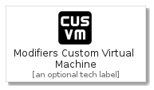
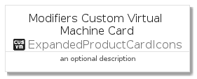
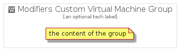

# ModifiersCustomVirtualMachine


```text
gcp/Item/ExpandedProductCardIcons/ModifiersCustomVirtualMachine
```

```text
include('gcp/Item/ExpandedProductCardIcons/ModifiersCustomVirtualMachine')
```


| Illustration | ModifiersCustomVirtualMachine | ModifiersCustomVirtualMachineCard | ModifiersCustomVirtualMachineGroup |
| :---: | :---: | :---: | :---: |
|  |  |  |  |


## ModifiersCustomVirtualMachine

### Load remotely
```plantuml
@startuml
' configures the library
!global $LIB_BASE_LOCATION="https://raw.githubusercontent.com/tmorin/plantuml-libs/master/distribution"

' loads the library's bootstrap
!include $LIB_BASE_LOCATION/bootstrap.puml

' loads the package bootstrap
include('gcp/bootstrap')

' loads the Item which embeds the element ModifiersCustomVirtualMachine
include('gcp/Item/ExpandedProductCardIcons/ModifiersCustomVirtualMachine')

' renders the element
ModifiersCustomVirtualMachine('ModifiersCustomVirtualMachine', 'Modifiers Custom Virtual Machine', 'an optional tech label')
@enduml
```

### Load locally
```plantuml
@startuml
' configures the library
!global $INCLUSION_MODE="local"
!global $LIB_BASE_LOCATION="../../.."

' loads the library's bootstrap
!include $LIB_BASE_LOCATION/bootstrap.puml

' loads the package bootstrap
include('gcp/bootstrap')

' loads the Item which embeds the element ModifiersCustomVirtualMachine
include('gcp/Item/ExpandedProductCardIcons/ModifiersCustomVirtualMachine')

' renders the element
ModifiersCustomVirtualMachine('ModifiersCustomVirtualMachine', 'Modifiers Custom Virtual Machine', 'an optional tech label')
@enduml
```

## ModifiersCustomVirtualMachineCard

### Load remotely
```plantuml
@startuml
' configures the library
!global $LIB_BASE_LOCATION="https://raw.githubusercontent.com/tmorin/plantuml-libs/master/distribution"

' loads the library's bootstrap
!include $LIB_BASE_LOCATION/bootstrap.puml

' loads the package bootstrap
include('gcp/bootstrap')

' loads the Item which embeds the element ModifiersCustomVirtualMachineCard
include('gcp/Item/ExpandedProductCardIcons/ModifiersCustomVirtualMachine')

' renders the element
ModifiersCustomVirtualMachineCard('ModifiersCustomVirtualMachineCard', 'Modifiers Custom Virtual Machine Card', 'an optional description')
@enduml
```

### Load locally
```plantuml
@startuml
' configures the library
!global $INCLUSION_MODE="local"
!global $LIB_BASE_LOCATION="../../.."

' loads the library's bootstrap
!include $LIB_BASE_LOCATION/bootstrap.puml

' loads the package bootstrap
include('gcp/bootstrap')

' loads the Item which embeds the element ModifiersCustomVirtualMachineCard
include('gcp/Item/ExpandedProductCardIcons/ModifiersCustomVirtualMachine')

' renders the element
ModifiersCustomVirtualMachineCard('ModifiersCustomVirtualMachineCard', 'Modifiers Custom Virtual Machine Card', 'an optional description')
@enduml
```

## ModifiersCustomVirtualMachineGroup

### Load remotely
```plantuml
@startuml
' configures the library
!global $LIB_BASE_LOCATION="https://raw.githubusercontent.com/tmorin/plantuml-libs/master/distribution"

' loads the library's bootstrap
!include $LIB_BASE_LOCATION/bootstrap.puml

' loads the package bootstrap
include('gcp/bootstrap')

' loads the Item which embeds the element ModifiersCustomVirtualMachineGroup
include('gcp/Item/ExpandedProductCardIcons/ModifiersCustomVirtualMachine')

' renders the element
ModifiersCustomVirtualMachineGroup('ModifiersCustomVirtualMachineGroup', 'Modifiers Custom Virtual Machine Group', 'an optional tech label') {
    note as note
        the content of the group
    end note
}
@enduml
```

### Load locally
```plantuml
@startuml
' configures the library
!global $INCLUSION_MODE="local"
!global $LIB_BASE_LOCATION="../../.."

' loads the library's bootstrap
!include $LIB_BASE_LOCATION/bootstrap.puml

' loads the package bootstrap
include('gcp/bootstrap')

' loads the Item which embeds the element ModifiersCustomVirtualMachineGroup
include('gcp/Item/ExpandedProductCardIcons/ModifiersCustomVirtualMachine')

' renders the element
ModifiersCustomVirtualMachineGroup('ModifiersCustomVirtualMachineGroup', 'Modifiers Custom Virtual Machine Group', 'an optional tech label') {
    note as note
        the content of the group
    end note
}
@enduml
```

