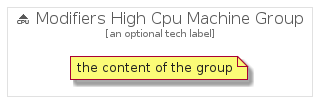

# ModifiersHighCpuMachine


```text
gcp/Item/ExpandedProductCardIcons/ModifiersHighCpuMachine
```

```text
include('gcp/Item/ExpandedProductCardIcons/ModifiersHighCpuMachine')
```


| Illustration | ModifiersHighCpuMachine | ModifiersHighCpuMachineCard | ModifiersHighCpuMachineGroup |
| :---: | :---: | :---: | :---: |
|  |  |  |  |


## ModifiersHighCpuMachine

### Load remotely
```plantuml
@startuml
' configures the library
!global $LIB_BASE_LOCATION="https://raw.githubusercontent.com/tmorin/plantuml-libs/master/distribution"

' loads the library's bootstrap
!include $LIB_BASE_LOCATION/bootstrap.puml

' loads the package bootstrap
include('gcp/bootstrap')

' loads the Item which embeds the element ModifiersHighCpuMachine
include('gcp/Item/ExpandedProductCardIcons/ModifiersHighCpuMachine')

' renders the element
ModifiersHighCpuMachine('ModifiersHighCpuMachine', 'Modifiers High Cpu Machine', 'an optional tech label')
@enduml
```

### Load locally
```plantuml
@startuml
' configures the library
!global $INCLUSION_MODE="local"
!global $LIB_BASE_LOCATION="../../.."

' loads the library's bootstrap
!include $LIB_BASE_LOCATION/bootstrap.puml

' loads the package bootstrap
include('gcp/bootstrap')

' loads the Item which embeds the element ModifiersHighCpuMachine
include('gcp/Item/ExpandedProductCardIcons/ModifiersHighCpuMachine')

' renders the element
ModifiersHighCpuMachine('ModifiersHighCpuMachine', 'Modifiers High Cpu Machine', 'an optional tech label')
@enduml
```

## ModifiersHighCpuMachineCard

### Load remotely
```plantuml
@startuml
' configures the library
!global $LIB_BASE_LOCATION="https://raw.githubusercontent.com/tmorin/plantuml-libs/master/distribution"

' loads the library's bootstrap
!include $LIB_BASE_LOCATION/bootstrap.puml

' loads the package bootstrap
include('gcp/bootstrap')

' loads the Item which embeds the element ModifiersHighCpuMachineCard
include('gcp/Item/ExpandedProductCardIcons/ModifiersHighCpuMachine')

' renders the element
ModifiersHighCpuMachineCard('ModifiersHighCpuMachineCard', 'Modifiers High Cpu Machine Card', 'an optional description')
@enduml
```

### Load locally
```plantuml
@startuml
' configures the library
!global $INCLUSION_MODE="local"
!global $LIB_BASE_LOCATION="../../.."

' loads the library's bootstrap
!include $LIB_BASE_LOCATION/bootstrap.puml

' loads the package bootstrap
include('gcp/bootstrap')

' loads the Item which embeds the element ModifiersHighCpuMachineCard
include('gcp/Item/ExpandedProductCardIcons/ModifiersHighCpuMachine')

' renders the element
ModifiersHighCpuMachineCard('ModifiersHighCpuMachineCard', 'Modifiers High Cpu Machine Card', 'an optional description')
@enduml
```

## ModifiersHighCpuMachineGroup

### Load remotely
```plantuml
@startuml
' configures the library
!global $LIB_BASE_LOCATION="https://raw.githubusercontent.com/tmorin/plantuml-libs/master/distribution"

' loads the library's bootstrap
!include $LIB_BASE_LOCATION/bootstrap.puml

' loads the package bootstrap
include('gcp/bootstrap')

' loads the Item which embeds the element ModifiersHighCpuMachineGroup
include('gcp/Item/ExpandedProductCardIcons/ModifiersHighCpuMachine')

' renders the element
ModifiersHighCpuMachineGroup('ModifiersHighCpuMachineGroup', 'Modifiers High Cpu Machine Group', 'an optional tech label') {
    note as note
        the content of the group
    end note
}
@enduml
```

### Load locally
```plantuml
@startuml
' configures the library
!global $INCLUSION_MODE="local"
!global $LIB_BASE_LOCATION="../../.."

' loads the library's bootstrap
!include $LIB_BASE_LOCATION/bootstrap.puml

' loads the package bootstrap
include('gcp/bootstrap')

' loads the Item which embeds the element ModifiersHighCpuMachineGroup
include('gcp/Item/ExpandedProductCardIcons/ModifiersHighCpuMachine')

' renders the element
ModifiersHighCpuMachineGroup('ModifiersHighCpuMachineGroup', 'Modifiers High Cpu Machine Group', 'an optional tech label') {
    note as note
        the content of the group
    end note
}
@enduml
```

