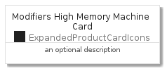
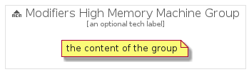

# ModifiersHighMemoryMachine


```text
gcp/Item/ExpandedProductCardIcons/ModifiersHighMemoryMachine
```

```text
include('gcp/Item/ExpandedProductCardIcons/ModifiersHighMemoryMachine')
```


| Illustration | ModifiersHighMemoryMachine | ModifiersHighMemoryMachineCard | ModifiersHighMemoryMachineGroup |
| :---: | :---: | :---: | :---: |
|  |  |  |  |


## ModifiersHighMemoryMachine

### Load remotely
```plantuml
@startuml
' configures the library
!global $LIB_BASE_LOCATION="https://github.com/tmorin/plantuml-libs/distribution"

' loads the library's bootstrap
!include $LIB_BASE_LOCATION/bootstrap.puml

' loads the package bootstrap
include('gcp/bootstrap')

' loads the Item which embeds the element ModifiersHighMemoryMachine
include('gcp/Item/ExpandedProductCardIcons/ModifiersHighMemoryMachine')

' renders the element
ModifiersHighMemoryMachine('ModifiersHighMemoryMachine', 'Modifiers High Memory Machine', 'an optional tech label')
@enduml
```

### Load locally
```plantuml
@startuml
' configures the library
!global $INCLUSION_MODE="local"
!global $LIB_BASE_LOCATION="../../.."

' loads the library's bootstrap
!include $LIB_BASE_LOCATION/bootstrap.puml

' loads the package bootstrap
include('gcp/bootstrap')

' loads the Item which embeds the element ModifiersHighMemoryMachine
include('gcp/Item/ExpandedProductCardIcons/ModifiersHighMemoryMachine')

' renders the element
ModifiersHighMemoryMachine('ModifiersHighMemoryMachine', 'Modifiers High Memory Machine', 'an optional tech label')
@enduml
```

## ModifiersHighMemoryMachineCard

### Load remotely
```plantuml
@startuml
' configures the library
!global $LIB_BASE_LOCATION="https://github.com/tmorin/plantuml-libs/distribution"

' loads the library's bootstrap
!include $LIB_BASE_LOCATION/bootstrap.puml

' loads the package bootstrap
include('gcp/bootstrap')

' loads the Item which embeds the element ModifiersHighMemoryMachineCard
include('gcp/Item/ExpandedProductCardIcons/ModifiersHighMemoryMachine')

' renders the element
ModifiersHighMemoryMachineCard('ModifiersHighMemoryMachineCard', 'Modifiers High Memory Machine Card', 'an optional description')
@enduml
```

### Load locally
```plantuml
@startuml
' configures the library
!global $INCLUSION_MODE="local"
!global $LIB_BASE_LOCATION="../../.."

' loads the library's bootstrap
!include $LIB_BASE_LOCATION/bootstrap.puml

' loads the package bootstrap
include('gcp/bootstrap')

' loads the Item which embeds the element ModifiersHighMemoryMachineCard
include('gcp/Item/ExpandedProductCardIcons/ModifiersHighMemoryMachine')

' renders the element
ModifiersHighMemoryMachineCard('ModifiersHighMemoryMachineCard', 'Modifiers High Memory Machine Card', 'an optional description')
@enduml
```

## ModifiersHighMemoryMachineGroup

### Load remotely
```plantuml
@startuml
' configures the library
!global $LIB_BASE_LOCATION="https://github.com/tmorin/plantuml-libs/distribution"

' loads the library's bootstrap
!include $LIB_BASE_LOCATION/bootstrap.puml

' loads the package bootstrap
include('gcp/bootstrap')

' loads the Item which embeds the element ModifiersHighMemoryMachineGroup
include('gcp/Item/ExpandedProductCardIcons/ModifiersHighMemoryMachine')

' renders the element
ModifiersHighMemoryMachineGroup('ModifiersHighMemoryMachineGroup', 'Modifiers High Memory Machine Group', 'an optional tech label') {
    note as note
        the content of the group
    end note
}
@enduml
```

### Load locally
```plantuml
@startuml
' configures the library
!global $INCLUSION_MODE="local"
!global $LIB_BASE_LOCATION="../../.."

' loads the library's bootstrap
!include $LIB_BASE_LOCATION/bootstrap.puml

' loads the package bootstrap
include('gcp/bootstrap')

' loads the Item which embeds the element ModifiersHighMemoryMachineGroup
include('gcp/Item/ExpandedProductCardIcons/ModifiersHighMemoryMachine')

' renders the element
ModifiersHighMemoryMachineGroup('ModifiersHighMemoryMachineGroup', 'Modifiers High Memory Machine Group', 'an optional tech label') {
    note as note
        the content of the group
    end note
}
@enduml
```

