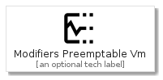
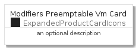
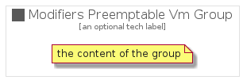

# ModifiersPreemptableVm


```text
gcp/Item/ExpandedProductCardIcons/ModifiersPreemptableVm
```

```text
include('gcp/Item/ExpandedProductCardIcons/ModifiersPreemptableVm')
```


| Illustration | ModifiersPreemptableVm | ModifiersPreemptableVmCard | ModifiersPreemptableVmGroup |
| :---: | :---: | :---: | :---: |
|  |  |  |  |


## ModifiersPreemptableVm

### Load remotely
```plantuml
@startuml
' configures the library
!global $LIB_BASE_LOCATION="https://raw.githubusercontent.com/tmorin/plantuml-libs/master/distribution"

' loads the library's bootstrap
!include $LIB_BASE_LOCATION/bootstrap.puml

' loads the package bootstrap
include('gcp/bootstrap')

' loads the Item which embeds the element ModifiersPreemptableVm
include('gcp/Item/ExpandedProductCardIcons/ModifiersPreemptableVm')

' renders the element
ModifiersPreemptableVm('ModifiersPreemptableVm', 'Modifiers Preemptable Vm', 'an optional tech label')
@enduml
```

### Load locally
```plantuml
@startuml
' configures the library
!global $INCLUSION_MODE="local"
!global $LIB_BASE_LOCATION="../../.."

' loads the library's bootstrap
!include $LIB_BASE_LOCATION/bootstrap.puml

' loads the package bootstrap
include('gcp/bootstrap')

' loads the Item which embeds the element ModifiersPreemptableVm
include('gcp/Item/ExpandedProductCardIcons/ModifiersPreemptableVm')

' renders the element
ModifiersPreemptableVm('ModifiersPreemptableVm', 'Modifiers Preemptable Vm', 'an optional tech label')
@enduml
```

## ModifiersPreemptableVmCard

### Load remotely
```plantuml
@startuml
' configures the library
!global $LIB_BASE_LOCATION="https://raw.githubusercontent.com/tmorin/plantuml-libs/master/distribution"

' loads the library's bootstrap
!include $LIB_BASE_LOCATION/bootstrap.puml

' loads the package bootstrap
include('gcp/bootstrap')

' loads the Item which embeds the element ModifiersPreemptableVmCard
include('gcp/Item/ExpandedProductCardIcons/ModifiersPreemptableVm')

' renders the element
ModifiersPreemptableVmCard('ModifiersPreemptableVmCard', 'Modifiers Preemptable Vm Card', 'an optional description')
@enduml
```

### Load locally
```plantuml
@startuml
' configures the library
!global $INCLUSION_MODE="local"
!global $LIB_BASE_LOCATION="../../.."

' loads the library's bootstrap
!include $LIB_BASE_LOCATION/bootstrap.puml

' loads the package bootstrap
include('gcp/bootstrap')

' loads the Item which embeds the element ModifiersPreemptableVmCard
include('gcp/Item/ExpandedProductCardIcons/ModifiersPreemptableVm')

' renders the element
ModifiersPreemptableVmCard('ModifiersPreemptableVmCard', 'Modifiers Preemptable Vm Card', 'an optional description')
@enduml
```

## ModifiersPreemptableVmGroup

### Load remotely
```plantuml
@startuml
' configures the library
!global $LIB_BASE_LOCATION="https://raw.githubusercontent.com/tmorin/plantuml-libs/master/distribution"

' loads the library's bootstrap
!include $LIB_BASE_LOCATION/bootstrap.puml

' loads the package bootstrap
include('gcp/bootstrap')

' loads the Item which embeds the element ModifiersPreemptableVmGroup
include('gcp/Item/ExpandedProductCardIcons/ModifiersPreemptableVm')

' renders the element
ModifiersPreemptableVmGroup('ModifiersPreemptableVmGroup', 'Modifiers Preemptable Vm Group', 'an optional tech label') {
    note as note
        the content of the group
    end note
}
@enduml
```

### Load locally
```plantuml
@startuml
' configures the library
!global $INCLUSION_MODE="local"
!global $LIB_BASE_LOCATION="../../.."

' loads the library's bootstrap
!include $LIB_BASE_LOCATION/bootstrap.puml

' loads the package bootstrap
include('gcp/bootstrap')

' loads the Item which embeds the element ModifiersPreemptableVmGroup
include('gcp/Item/ExpandedProductCardIcons/ModifiersPreemptableVm')

' renders the element
ModifiersPreemptableVmGroup('ModifiersPreemptableVmGroup', 'Modifiers Preemptable Vm Group', 'an optional tech label') {
    note as note
        the content of the group
    end note
}
@enduml
```

