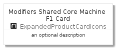

# ModifiersSharedCoreMachineF1


```text
gcp/Item/ExpandedProductCardIcons/ModifiersSharedCoreMachineF1
```

```text
include('gcp/Item/ExpandedProductCardIcons/ModifiersSharedCoreMachineF1')
```


| Illustration | ModifiersSharedCoreMachineF1 | ModifiersSharedCoreMachineF1Card | ModifiersSharedCoreMachineF1Group |
| :---: | :---: | :---: | :---: |
|  |  |  |  |


## ModifiersSharedCoreMachineF1

### Load remotely
```plantuml
@startuml
' configures the library
!global $LIB_BASE_LOCATION="https://raw.githubusercontent.com/tmorin/plantuml-libs/master/distribution"

' loads the library's bootstrap
!include $LIB_BASE_LOCATION/bootstrap.puml

' loads the package bootstrap
include('gcp/bootstrap')

' loads the Item which embeds the element ModifiersSharedCoreMachineF1
include('gcp/Item/ExpandedProductCardIcons/ModifiersSharedCoreMachineF1')

' renders the element
ModifiersSharedCoreMachineF1('ModifiersSharedCoreMachineF1', 'Modifiers Shared Core Machine F1', 'an optional tech label')
@enduml
```

### Load locally
```plantuml
@startuml
' configures the library
!global $INCLUSION_MODE="local"
!global $LIB_BASE_LOCATION="../../.."

' loads the library's bootstrap
!include $LIB_BASE_LOCATION/bootstrap.puml

' loads the package bootstrap
include('gcp/bootstrap')

' loads the Item which embeds the element ModifiersSharedCoreMachineF1
include('gcp/Item/ExpandedProductCardIcons/ModifiersSharedCoreMachineF1')

' renders the element
ModifiersSharedCoreMachineF1('ModifiersSharedCoreMachineF1', 'Modifiers Shared Core Machine F1', 'an optional tech label')
@enduml
```

## ModifiersSharedCoreMachineF1Card

### Load remotely
```plantuml
@startuml
' configures the library
!global $LIB_BASE_LOCATION="https://raw.githubusercontent.com/tmorin/plantuml-libs/master/distribution"

' loads the library's bootstrap
!include $LIB_BASE_LOCATION/bootstrap.puml

' loads the package bootstrap
include('gcp/bootstrap')

' loads the Item which embeds the element ModifiersSharedCoreMachineF1Card
include('gcp/Item/ExpandedProductCardIcons/ModifiersSharedCoreMachineF1')

' renders the element
ModifiersSharedCoreMachineF1Card('ModifiersSharedCoreMachineF1Card', 'Modifiers Shared Core Machine F1 Card', 'an optional description')
@enduml
```

### Load locally
```plantuml
@startuml
' configures the library
!global $INCLUSION_MODE="local"
!global $LIB_BASE_LOCATION="../../.."

' loads the library's bootstrap
!include $LIB_BASE_LOCATION/bootstrap.puml

' loads the package bootstrap
include('gcp/bootstrap')

' loads the Item which embeds the element ModifiersSharedCoreMachineF1Card
include('gcp/Item/ExpandedProductCardIcons/ModifiersSharedCoreMachineF1')

' renders the element
ModifiersSharedCoreMachineF1Card('ModifiersSharedCoreMachineF1Card', 'Modifiers Shared Core Machine F1 Card', 'an optional description')
@enduml
```

## ModifiersSharedCoreMachineF1Group

### Load remotely
```plantuml
@startuml
' configures the library
!global $LIB_BASE_LOCATION="https://raw.githubusercontent.com/tmorin/plantuml-libs/master/distribution"

' loads the library's bootstrap
!include $LIB_BASE_LOCATION/bootstrap.puml

' loads the package bootstrap
include('gcp/bootstrap')

' loads the Item which embeds the element ModifiersSharedCoreMachineF1Group
include('gcp/Item/ExpandedProductCardIcons/ModifiersSharedCoreMachineF1')

' renders the element
ModifiersSharedCoreMachineF1Group('ModifiersSharedCoreMachineF1Group', 'Modifiers Shared Core Machine F1 Group', 'an optional tech label') {
    note as note
        the content of the group
    end note
}
@enduml
```

### Load locally
```plantuml
@startuml
' configures the library
!global $INCLUSION_MODE="local"
!global $LIB_BASE_LOCATION="../../.."

' loads the library's bootstrap
!include $LIB_BASE_LOCATION/bootstrap.puml

' loads the package bootstrap
include('gcp/bootstrap')

' loads the Item which embeds the element ModifiersSharedCoreMachineF1Group
include('gcp/Item/ExpandedProductCardIcons/ModifiersSharedCoreMachineF1')

' renders the element
ModifiersSharedCoreMachineF1Group('ModifiersSharedCoreMachineF1Group', 'Modifiers Shared Core Machine F1 Group', 'an optional tech label') {
    note as note
        the content of the group
    end note
}
@enduml
```

