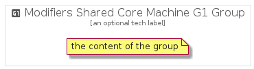

# ModifiersSharedCoreMachineG1


```text
gcp/Item/ExpandedProductCardIcons/ModifiersSharedCoreMachineG1
```

```text
include('gcp/Item/ExpandedProductCardIcons/ModifiersSharedCoreMachineG1')
```


| Illustration | ModifiersSharedCoreMachineG1 | ModifiersSharedCoreMachineG1Card | ModifiersSharedCoreMachineG1Group |
| :---: | :---: | :---: | :---: |
|  |  |  |  |


## ModifiersSharedCoreMachineG1

### Load remotely
```plantuml
@startuml
' configures the library
!global $LIB_BASE_LOCATION="https://raw.githubusercontent.com/tmorin/plantuml-libs/master/distribution"

' loads the library's bootstrap
!include $LIB_BASE_LOCATION/bootstrap.puml

' loads the package bootstrap
include('gcp/bootstrap')

' loads the Item which embeds the element ModifiersSharedCoreMachineG1
include('gcp/Item/ExpandedProductCardIcons/ModifiersSharedCoreMachineG1')

' renders the element
ModifiersSharedCoreMachineG1('ModifiersSharedCoreMachineG1', 'Modifiers Shared Core Machine G1', 'an optional tech label')
@enduml
```

### Load locally
```plantuml
@startuml
' configures the library
!global $INCLUSION_MODE="local"
!global $LIB_BASE_LOCATION="../../.."

' loads the library's bootstrap
!include $LIB_BASE_LOCATION/bootstrap.puml

' loads the package bootstrap
include('gcp/bootstrap')

' loads the Item which embeds the element ModifiersSharedCoreMachineG1
include('gcp/Item/ExpandedProductCardIcons/ModifiersSharedCoreMachineG1')

' renders the element
ModifiersSharedCoreMachineG1('ModifiersSharedCoreMachineG1', 'Modifiers Shared Core Machine G1', 'an optional tech label')
@enduml
```

## ModifiersSharedCoreMachineG1Card

### Load remotely
```plantuml
@startuml
' configures the library
!global $LIB_BASE_LOCATION="https://raw.githubusercontent.com/tmorin/plantuml-libs/master/distribution"

' loads the library's bootstrap
!include $LIB_BASE_LOCATION/bootstrap.puml

' loads the package bootstrap
include('gcp/bootstrap')

' loads the Item which embeds the element ModifiersSharedCoreMachineG1Card
include('gcp/Item/ExpandedProductCardIcons/ModifiersSharedCoreMachineG1')

' renders the element
ModifiersSharedCoreMachineG1Card('ModifiersSharedCoreMachineG1Card', 'Modifiers Shared Core Machine G1 Card', 'an optional description')
@enduml
```

### Load locally
```plantuml
@startuml
' configures the library
!global $INCLUSION_MODE="local"
!global $LIB_BASE_LOCATION="../../.."

' loads the library's bootstrap
!include $LIB_BASE_LOCATION/bootstrap.puml

' loads the package bootstrap
include('gcp/bootstrap')

' loads the Item which embeds the element ModifiersSharedCoreMachineG1Card
include('gcp/Item/ExpandedProductCardIcons/ModifiersSharedCoreMachineG1')

' renders the element
ModifiersSharedCoreMachineG1Card('ModifiersSharedCoreMachineG1Card', 'Modifiers Shared Core Machine G1 Card', 'an optional description')
@enduml
```

## ModifiersSharedCoreMachineG1Group

### Load remotely
```plantuml
@startuml
' configures the library
!global $LIB_BASE_LOCATION="https://raw.githubusercontent.com/tmorin/plantuml-libs/master/distribution"

' loads the library's bootstrap
!include $LIB_BASE_LOCATION/bootstrap.puml

' loads the package bootstrap
include('gcp/bootstrap')

' loads the Item which embeds the element ModifiersSharedCoreMachineG1Group
include('gcp/Item/ExpandedProductCardIcons/ModifiersSharedCoreMachineG1')

' renders the element
ModifiersSharedCoreMachineG1Group('ModifiersSharedCoreMachineG1Group', 'Modifiers Shared Core Machine G1 Group', 'an optional tech label') {
    note as note
        the content of the group
    end note
}
@enduml
```

### Load locally
```plantuml
@startuml
' configures the library
!global $INCLUSION_MODE="local"
!global $LIB_BASE_LOCATION="../../.."

' loads the library's bootstrap
!include $LIB_BASE_LOCATION/bootstrap.puml

' loads the package bootstrap
include('gcp/bootstrap')

' loads the Item which embeds the element ModifiersSharedCoreMachineG1Group
include('gcp/Item/ExpandedProductCardIcons/ModifiersSharedCoreMachineG1')

' renders the element
ModifiersSharedCoreMachineG1Group('ModifiersSharedCoreMachineG1Group', 'Modifiers Shared Core Machine G1 Group', 'an optional tech label') {
    note as note
        the content of the group
    end note
}
@enduml
```

