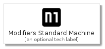
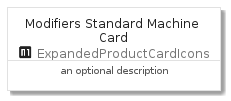
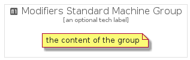

# ModifiersStandardMachine


```text
gcp/Item/ExpandedProductCardIcons/ModifiersStandardMachine
```

```text
include('gcp/Item/ExpandedProductCardIcons/ModifiersStandardMachine')
```


| Illustration | ModifiersStandardMachine | ModifiersStandardMachineCard | ModifiersStandardMachineGroup |
| :---: | :---: | :---: | :---: |
|  |  |  |  |


## ModifiersStandardMachine

### Load remotely
```plantuml
@startuml
' configures the library
!global $LIB_BASE_LOCATION="https://raw.githubusercontent.com/tmorin/plantuml-libs/master/distribution"

' loads the library's bootstrap
!include $LIB_BASE_LOCATION/bootstrap.puml

' loads the package bootstrap
include('gcp/bootstrap')

' loads the Item which embeds the element ModifiersStandardMachine
include('gcp/Item/ExpandedProductCardIcons/ModifiersStandardMachine')

' renders the element
ModifiersStandardMachine('ModifiersStandardMachine', 'Modifiers Standard Machine', 'an optional tech label')
@enduml
```

### Load locally
```plantuml
@startuml
' configures the library
!global $INCLUSION_MODE="local"
!global $LIB_BASE_LOCATION="../../.."

' loads the library's bootstrap
!include $LIB_BASE_LOCATION/bootstrap.puml

' loads the package bootstrap
include('gcp/bootstrap')

' loads the Item which embeds the element ModifiersStandardMachine
include('gcp/Item/ExpandedProductCardIcons/ModifiersStandardMachine')

' renders the element
ModifiersStandardMachine('ModifiersStandardMachine', 'Modifiers Standard Machine', 'an optional tech label')
@enduml
```

## ModifiersStandardMachineCard

### Load remotely
```plantuml
@startuml
' configures the library
!global $LIB_BASE_LOCATION="https://raw.githubusercontent.com/tmorin/plantuml-libs/master/distribution"

' loads the library's bootstrap
!include $LIB_BASE_LOCATION/bootstrap.puml

' loads the package bootstrap
include('gcp/bootstrap')

' loads the Item which embeds the element ModifiersStandardMachineCard
include('gcp/Item/ExpandedProductCardIcons/ModifiersStandardMachine')

' renders the element
ModifiersStandardMachineCard('ModifiersStandardMachineCard', 'Modifiers Standard Machine Card', 'an optional description')
@enduml
```

### Load locally
```plantuml
@startuml
' configures the library
!global $INCLUSION_MODE="local"
!global $LIB_BASE_LOCATION="../../.."

' loads the library's bootstrap
!include $LIB_BASE_LOCATION/bootstrap.puml

' loads the package bootstrap
include('gcp/bootstrap')

' loads the Item which embeds the element ModifiersStandardMachineCard
include('gcp/Item/ExpandedProductCardIcons/ModifiersStandardMachine')

' renders the element
ModifiersStandardMachineCard('ModifiersStandardMachineCard', 'Modifiers Standard Machine Card', 'an optional description')
@enduml
```

## ModifiersStandardMachineGroup

### Load remotely
```plantuml
@startuml
' configures the library
!global $LIB_BASE_LOCATION="https://raw.githubusercontent.com/tmorin/plantuml-libs/master/distribution"

' loads the library's bootstrap
!include $LIB_BASE_LOCATION/bootstrap.puml

' loads the package bootstrap
include('gcp/bootstrap')

' loads the Item which embeds the element ModifiersStandardMachineGroup
include('gcp/Item/ExpandedProductCardIcons/ModifiersStandardMachine')

' renders the element
ModifiersStandardMachineGroup('ModifiersStandardMachineGroup', 'Modifiers Standard Machine Group', 'an optional tech label') {
    note as note
        the content of the group
    end note
}
@enduml
```

### Load locally
```plantuml
@startuml
' configures the library
!global $INCLUSION_MODE="local"
!global $LIB_BASE_LOCATION="../../.."

' loads the library's bootstrap
!include $LIB_BASE_LOCATION/bootstrap.puml

' loads the package bootstrap
include('gcp/bootstrap')

' loads the Item which embeds the element ModifiersStandardMachineGroup
include('gcp/Item/ExpandedProductCardIcons/ModifiersStandardMachine')

' renders the element
ModifiersStandardMachineGroup('ModifiersStandardMachineGroup', 'Modifiers Standard Machine Group', 'an optional tech label') {
    note as note
        the content of the group
    end note
}
@enduml
```

