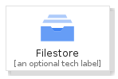
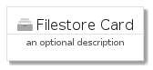
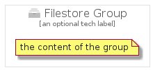

# Filestore


```text
gcp/Item/Filestore
```

```text
include('gcp/Item/Filestore')
```


| Illustration | Filestore | FilestoreCard | FilestoreGroup |
| :---: | :---: | :---: | :---: |
|  |  |  |  |


## Sprites
The item provides the following sriptes:

- `<$FilestoreXs>`
- `<$FilestoreSm>`
- `<$FilestoreMd>`
- `<$FilestoreLg>`


## Filestore

### Load remotely
```plantuml
@startuml
' configures the library
!global $LIB_BASE_LOCATION="https://raw.githubusercontent.com/tmorin/plantuml-libs/master/distribution"

' loads the library's bootstrap
!include $LIB_BASE_LOCATION/bootstrap.puml

' loads the package bootstrap
include('gcp/bootstrap')

' loads the Item which embeds the element Filestore
include('gcp/Item/Filestore')

' renders the element
Filestore('Filestore', 'Filestore', 'an optional tech label', 'an optional description')
@enduml
```

### Load locally
```plantuml
@startuml
' configures the library
!global $INCLUSION_MODE="local"
!global $LIB_BASE_LOCATION="../.."

' loads the library's bootstrap
!include $LIB_BASE_LOCATION/bootstrap.puml

' loads the package bootstrap
include('gcp/bootstrap')

' loads the Item which embeds the element Filestore
include('gcp/Item/Filestore')

' renders the element
Filestore('Filestore', 'Filestore', 'an optional tech label', 'an optional description')
@enduml
```

## FilestoreCard

### Load remotely
```plantuml
@startuml
' configures the library
!global $LIB_BASE_LOCATION="https://raw.githubusercontent.com/tmorin/plantuml-libs/master/distribution"

' loads the library's bootstrap
!include $LIB_BASE_LOCATION/bootstrap.puml

' loads the package bootstrap
include('gcp/bootstrap')

' loads the Item which embeds the element FilestoreCard
include('gcp/Item/Filestore')

' renders the element
FilestoreCard('FilestoreCard', 'Filestore Card', 'an optional description')
@enduml
```

### Load locally
```plantuml
@startuml
' configures the library
!global $INCLUSION_MODE="local"
!global $LIB_BASE_LOCATION="../.."

' loads the library's bootstrap
!include $LIB_BASE_LOCATION/bootstrap.puml

' loads the package bootstrap
include('gcp/bootstrap')

' loads the Item which embeds the element FilestoreCard
include('gcp/Item/Filestore')

' renders the element
FilestoreCard('FilestoreCard', 'Filestore Card', 'an optional description')
@enduml
```

## FilestoreGroup

### Load remotely
```plantuml
@startuml
' configures the library
!global $LIB_BASE_LOCATION="https://raw.githubusercontent.com/tmorin/plantuml-libs/master/distribution"

' loads the library's bootstrap
!include $LIB_BASE_LOCATION/bootstrap.puml

' loads the package bootstrap
include('gcp/bootstrap')

' loads the Item which embeds the element FilestoreGroup
include('gcp/Item/Filestore')

' renders the element
FilestoreGroup('FilestoreGroup', 'Filestore Group', 'an optional tech label') {
    note as note
        the content of the group
    end note
}
@enduml
```

### Load locally
```plantuml
@startuml
' configures the library
!global $INCLUSION_MODE="local"
!global $LIB_BASE_LOCATION="../.."

' loads the library's bootstrap
!include $LIB_BASE_LOCATION/bootstrap.puml

' loads the package bootstrap
include('gcp/bootstrap')

' loads the Item which embeds the element FilestoreGroup
include('gcp/Item/Filestore')

' renders the element
FilestoreGroup('FilestoreGroup', 'Filestore Group', 'an optional tech label') {
    note as note
        the content of the group
    end note
}
@enduml
```

