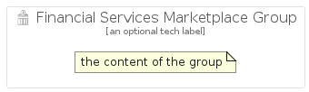

# FinancialServicesMarketplace


```text
gcp/Item/FinancialServicesMarketplace
```

```text
include('gcp/Item/FinancialServicesMarketplace')
```


| Illustration | FinancialServicesMarketplace | FinancialServicesMarketplaceCard | FinancialServicesMarketplaceGroup |
| :---: | :---: | :---: | :---: |
|  |  |  |  |


## FinancialServicesMarketplace

### Load remotely
```plantuml
@startuml
' configures the library
!global $LIB_BASE_LOCATION="https://raw.githubusercontent.com/tmorin/plantuml-libs/master/distribution"

' loads the library's bootstrap
!include $LIB_BASE_LOCATION/bootstrap.puml

' loads the package bootstrap
include('gcp/bootstrap')

' loads the Item which embeds the element FinancialServicesMarketplace
include('gcp/Item/FinancialServicesMarketplace')

' renders the element
FinancialServicesMarketplace('FinancialServicesMarketplace', 'Financial Services Marketplace', 'an optional tech label', 'an optional description')
@enduml
```

### Load locally
```plantuml
@startuml
' configures the library
!global $INCLUSION_MODE="local"
!global $LIB_BASE_LOCATION="../.."

' loads the library's bootstrap
!include $LIB_BASE_LOCATION/bootstrap.puml

' loads the package bootstrap
include('gcp/bootstrap')

' loads the Item which embeds the element FinancialServicesMarketplace
include('gcp/Item/FinancialServicesMarketplace')

' renders the element
FinancialServicesMarketplace('FinancialServicesMarketplace', 'Financial Services Marketplace', 'an optional tech label', 'an optional description')
@enduml
```

## FinancialServicesMarketplaceCard

### Load remotely
```plantuml
@startuml
' configures the library
!global $LIB_BASE_LOCATION="https://raw.githubusercontent.com/tmorin/plantuml-libs/master/distribution"

' loads the library's bootstrap
!include $LIB_BASE_LOCATION/bootstrap.puml

' loads the package bootstrap
include('gcp/bootstrap')

' loads the Item which embeds the element FinancialServicesMarketplaceCard
include('gcp/Item/FinancialServicesMarketplace')

' renders the element
FinancialServicesMarketplaceCard('FinancialServicesMarketplaceCard', 'Financial Services Marketplace Card', 'an optional description')
@enduml
```

### Load locally
```plantuml
@startuml
' configures the library
!global $INCLUSION_MODE="local"
!global $LIB_BASE_LOCATION="../.."

' loads the library's bootstrap
!include $LIB_BASE_LOCATION/bootstrap.puml

' loads the package bootstrap
include('gcp/bootstrap')

' loads the Item which embeds the element FinancialServicesMarketplaceCard
include('gcp/Item/FinancialServicesMarketplace')

' renders the element
FinancialServicesMarketplaceCard('FinancialServicesMarketplaceCard', 'Financial Services Marketplace Card', 'an optional description')
@enduml
```

## FinancialServicesMarketplaceGroup

### Load remotely
```plantuml
@startuml
' configures the library
!global $LIB_BASE_LOCATION="https://raw.githubusercontent.com/tmorin/plantuml-libs/master/distribution"

' loads the library's bootstrap
!include $LIB_BASE_LOCATION/bootstrap.puml

' loads the package bootstrap
include('gcp/bootstrap')

' loads the Item which embeds the element FinancialServicesMarketplaceGroup
include('gcp/Item/FinancialServicesMarketplace')

' renders the element
FinancialServicesMarketplaceGroup('FinancialServicesMarketplaceGroup', 'Financial Services Marketplace Group', 'an optional tech label') {
    note as note
        the content of the group
    end note
}
@enduml
```

### Load locally
```plantuml
@startuml
' configures the library
!global $INCLUSION_MODE="local"
!global $LIB_BASE_LOCATION="../.."

' loads the library's bootstrap
!include $LIB_BASE_LOCATION/bootstrap.puml

' loads the package bootstrap
include('gcp/bootstrap')

' loads the Item which embeds the element FinancialServicesMarketplaceGroup
include('gcp/Item/FinancialServicesMarketplace')

' renders the element
FinancialServicesMarketplaceGroup('FinancialServicesMarketplaceGroup', 'Financial Services Marketplace Group', 'an optional tech label') {
    note as note
        the content of the group
    end note
}
@enduml
```

