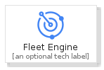
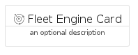
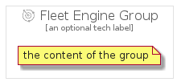

# FleetEngine


```text
gcp/Item/FleetEngine
```

```text
include('gcp/Item/FleetEngine')
```


| Illustration | FleetEngine | FleetEngineCard | FleetEngineGroup |
| :---: | :---: | :---: | :---: |
|  |  |  |  |


## Sprites
The item provides the following sriptes:

- `<$FleetEngineXs>`
- `<$FleetEngineSm>`
- `<$FleetEngineMd>`
- `<$FleetEngineLg>`


## FleetEngine

### Load remotely
```plantuml
@startuml
' configures the library
!global $LIB_BASE_LOCATION="https://raw.githubusercontent.com/tmorin/plantuml-libs/master/distribution"

' loads the library's bootstrap
!include $LIB_BASE_LOCATION/bootstrap.puml

' loads the package bootstrap
include('gcp/bootstrap')

' loads the Item which embeds the element FleetEngine
include('gcp/Item/FleetEngine')

' renders the element
FleetEngine('FleetEngine', 'Fleet Engine', 'an optional tech label', 'an optional description')
@enduml
```

### Load locally
```plantuml
@startuml
' configures the library
!global $INCLUSION_MODE="local"
!global $LIB_BASE_LOCATION="../.."

' loads the library's bootstrap
!include $LIB_BASE_LOCATION/bootstrap.puml

' loads the package bootstrap
include('gcp/bootstrap')

' loads the Item which embeds the element FleetEngine
include('gcp/Item/FleetEngine')

' renders the element
FleetEngine('FleetEngine', 'Fleet Engine', 'an optional tech label', 'an optional description')
@enduml
```

## FleetEngineCard

### Load remotely
```plantuml
@startuml
' configures the library
!global $LIB_BASE_LOCATION="https://raw.githubusercontent.com/tmorin/plantuml-libs/master/distribution"

' loads the library's bootstrap
!include $LIB_BASE_LOCATION/bootstrap.puml

' loads the package bootstrap
include('gcp/bootstrap')

' loads the Item which embeds the element FleetEngineCard
include('gcp/Item/FleetEngine')

' renders the element
FleetEngineCard('FleetEngineCard', 'Fleet Engine Card', 'an optional description')
@enduml
```

### Load locally
```plantuml
@startuml
' configures the library
!global $INCLUSION_MODE="local"
!global $LIB_BASE_LOCATION="../.."

' loads the library's bootstrap
!include $LIB_BASE_LOCATION/bootstrap.puml

' loads the package bootstrap
include('gcp/bootstrap')

' loads the Item which embeds the element FleetEngineCard
include('gcp/Item/FleetEngine')

' renders the element
FleetEngineCard('FleetEngineCard', 'Fleet Engine Card', 'an optional description')
@enduml
```

## FleetEngineGroup

### Load remotely
```plantuml
@startuml
' configures the library
!global $LIB_BASE_LOCATION="https://raw.githubusercontent.com/tmorin/plantuml-libs/master/distribution"

' loads the library's bootstrap
!include $LIB_BASE_LOCATION/bootstrap.puml

' loads the package bootstrap
include('gcp/bootstrap')

' loads the Item which embeds the element FleetEngineGroup
include('gcp/Item/FleetEngine')

' renders the element
FleetEngineGroup('FleetEngineGroup', 'Fleet Engine Group', 'an optional tech label') {
    note as note
        the content of the group
    end note
}
@enduml
```

### Load locally
```plantuml
@startuml
' configures the library
!global $INCLUSION_MODE="local"
!global $LIB_BASE_LOCATION="../.."

' loads the library's bootstrap
!include $LIB_BASE_LOCATION/bootstrap.puml

' loads the package bootstrap
include('gcp/bootstrap')

' loads the Item which embeds the element FleetEngineGroup
include('gcp/Item/FleetEngine')

' renders the element
FleetEngineGroup('FleetEngineGroup', 'Fleet Engine Group', 'an optional tech label') {
    note as note
        the content of the group
    end note
}
@enduml
```

