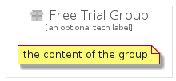

# FreeTrial


```text
gcp/Item/FreeTrial
```

```text
include('gcp/Item/FreeTrial')
```


| Illustration | FreeTrial | FreeTrialCard | FreeTrialGroup |
| :---: | :---: | :---: | :---: |
|  |  |  |  |


## Sprites
The item provides the following sriptes:

- `<$FreeTrialXs>`
- `<$FreeTrialSm>`
- `<$FreeTrialMd>`
- `<$FreeTrialLg>`


## FreeTrial

### Load remotely
```plantuml
@startuml
' configures the library
!global $LIB_BASE_LOCATION="https://raw.githubusercontent.com/tmorin/plantuml-libs/master/distribution"

' loads the library's bootstrap
!include $LIB_BASE_LOCATION/bootstrap.puml

' loads the package bootstrap
include('gcp/bootstrap')

' loads the Item which embeds the element FreeTrial
include('gcp/Item/FreeTrial')

' renders the element
FreeTrial('FreeTrial', 'Free Trial', 'an optional tech label', 'an optional description')
@enduml
```

### Load locally
```plantuml
@startuml
' configures the library
!global $INCLUSION_MODE="local"
!global $LIB_BASE_LOCATION="../.."

' loads the library's bootstrap
!include $LIB_BASE_LOCATION/bootstrap.puml

' loads the package bootstrap
include('gcp/bootstrap')

' loads the Item which embeds the element FreeTrial
include('gcp/Item/FreeTrial')

' renders the element
FreeTrial('FreeTrial', 'Free Trial', 'an optional tech label', 'an optional description')
@enduml
```

## FreeTrialCard

### Load remotely
```plantuml
@startuml
' configures the library
!global $LIB_BASE_LOCATION="https://raw.githubusercontent.com/tmorin/plantuml-libs/master/distribution"

' loads the library's bootstrap
!include $LIB_BASE_LOCATION/bootstrap.puml

' loads the package bootstrap
include('gcp/bootstrap')

' loads the Item which embeds the element FreeTrialCard
include('gcp/Item/FreeTrial')

' renders the element
FreeTrialCard('FreeTrialCard', 'Free Trial Card', 'an optional description')
@enduml
```

### Load locally
```plantuml
@startuml
' configures the library
!global $INCLUSION_MODE="local"
!global $LIB_BASE_LOCATION="../.."

' loads the library's bootstrap
!include $LIB_BASE_LOCATION/bootstrap.puml

' loads the package bootstrap
include('gcp/bootstrap')

' loads the Item which embeds the element FreeTrialCard
include('gcp/Item/FreeTrial')

' renders the element
FreeTrialCard('FreeTrialCard', 'Free Trial Card', 'an optional description')
@enduml
```

## FreeTrialGroup

### Load remotely
```plantuml
@startuml
' configures the library
!global $LIB_BASE_LOCATION="https://raw.githubusercontent.com/tmorin/plantuml-libs/master/distribution"

' loads the library's bootstrap
!include $LIB_BASE_LOCATION/bootstrap.puml

' loads the package bootstrap
include('gcp/bootstrap')

' loads the Item which embeds the element FreeTrialGroup
include('gcp/Item/FreeTrial')

' renders the element
FreeTrialGroup('FreeTrialGroup', 'Free Trial Group', 'an optional tech label') {
    note as note
        the content of the group
    end note
}
@enduml
```

### Load locally
```plantuml
@startuml
' configures the library
!global $INCLUSION_MODE="local"
!global $LIB_BASE_LOCATION="../.."

' loads the library's bootstrap
!include $LIB_BASE_LOCATION/bootstrap.puml

' loads the package bootstrap
include('gcp/bootstrap')

' loads the Item which embeds the element FreeTrialGroup
include('gcp/Item/FreeTrial')

' renders the element
FreeTrialGroup('FreeTrialGroup', 'Free Trial Group', 'an optional tech label') {
    note as note
        the content of the group
    end note
}
@enduml
```

