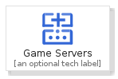
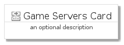
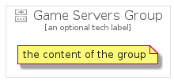

# GameServers


```text
gcp/Item/GameServers
```

```text
include('gcp/Item/GameServers')
```


| Illustration | GameServers | GameServersCard | GameServersGroup |
| :---: | :---: | :---: | :---: |
|  |  |  |  |


## GameServers

### Load remotely
```plantuml
@startuml
' configures the library
!global $LIB_BASE_LOCATION="https://raw.githubusercontent.com/tmorin/plantuml-libs/master/distribution"

' loads the library's bootstrap
!include $LIB_BASE_LOCATION/bootstrap.puml

' loads the package bootstrap
include('gcp/bootstrap')

' loads the Item which embeds the element GameServers
include('gcp/Item/GameServers')

' renders the element
GameServers('GameServers', 'Game Servers', 'an optional tech label', 'an optional description')
@enduml
```

### Load locally
```plantuml
@startuml
' configures the library
!global $INCLUSION_MODE="local"
!global $LIB_BASE_LOCATION="../.."

' loads the library's bootstrap
!include $LIB_BASE_LOCATION/bootstrap.puml

' loads the package bootstrap
include('gcp/bootstrap')

' loads the Item which embeds the element GameServers
include('gcp/Item/GameServers')

' renders the element
GameServers('GameServers', 'Game Servers', 'an optional tech label', 'an optional description')
@enduml
```

## GameServersCard

### Load remotely
```plantuml
@startuml
' configures the library
!global $LIB_BASE_LOCATION="https://raw.githubusercontent.com/tmorin/plantuml-libs/master/distribution"

' loads the library's bootstrap
!include $LIB_BASE_LOCATION/bootstrap.puml

' loads the package bootstrap
include('gcp/bootstrap')

' loads the Item which embeds the element GameServersCard
include('gcp/Item/GameServers')

' renders the element
GameServersCard('GameServersCard', 'Game Servers Card', 'an optional description')
@enduml
```

### Load locally
```plantuml
@startuml
' configures the library
!global $INCLUSION_MODE="local"
!global $LIB_BASE_LOCATION="../.."

' loads the library's bootstrap
!include $LIB_BASE_LOCATION/bootstrap.puml

' loads the package bootstrap
include('gcp/bootstrap')

' loads the Item which embeds the element GameServersCard
include('gcp/Item/GameServers')

' renders the element
GameServersCard('GameServersCard', 'Game Servers Card', 'an optional description')
@enduml
```

## GameServersGroup

### Load remotely
```plantuml
@startuml
' configures the library
!global $LIB_BASE_LOCATION="https://raw.githubusercontent.com/tmorin/plantuml-libs/master/distribution"

' loads the library's bootstrap
!include $LIB_BASE_LOCATION/bootstrap.puml

' loads the package bootstrap
include('gcp/bootstrap')

' loads the Item which embeds the element GameServersGroup
include('gcp/Item/GameServers')

' renders the element
GameServersGroup('GameServersGroup', 'Game Servers Group', 'an optional tech label') {
    note as note
        the content of the group
    end note
}
@enduml
```

### Load locally
```plantuml
@startuml
' configures the library
!global $INCLUSION_MODE="local"
!global $LIB_BASE_LOCATION="../.."

' loads the library's bootstrap
!include $LIB_BASE_LOCATION/bootstrap.puml

' loads the package bootstrap
include('gcp/bootstrap')

' loads the Item which embeds the element GameServersGroup
include('gcp/Item/GameServers')

' renders the element
GameServersGroup('GameServersGroup', 'Game Servers Group', 'an optional tech label') {
    note as note
        the content of the group
    end note
}
@enduml
```

