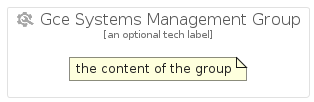

# GceSystemsManagement


```text
gcp/Item/GceSystemsManagement
```

```text
include('gcp/Item/GceSystemsManagement')
```


| Illustration | GceSystemsManagement | GceSystemsManagementCard | GceSystemsManagementGroup |
| :---: | :---: | :---: | :---: |
|  |  |  |  |


## GceSystemsManagement

### Load remotely
```plantuml
@startuml
' configures the library
!global $LIB_BASE_LOCATION="https://raw.githubusercontent.com/tmorin/plantuml-libs/master/distribution"

' loads the library's bootstrap
!include $LIB_BASE_LOCATION/bootstrap.puml

' loads the package bootstrap
include('gcp/bootstrap')

' loads the Item which embeds the element GceSystemsManagement
include('gcp/Item/GceSystemsManagement')

' renders the element
GceSystemsManagement('GceSystemsManagement', 'Gce Systems Management', 'an optional tech label', 'an optional description')
@enduml
```

### Load locally
```plantuml
@startuml
' configures the library
!global $INCLUSION_MODE="local"
!global $LIB_BASE_LOCATION="../.."

' loads the library's bootstrap
!include $LIB_BASE_LOCATION/bootstrap.puml

' loads the package bootstrap
include('gcp/bootstrap')

' loads the Item which embeds the element GceSystemsManagement
include('gcp/Item/GceSystemsManagement')

' renders the element
GceSystemsManagement('GceSystemsManagement', 'Gce Systems Management', 'an optional tech label', 'an optional description')
@enduml
```

## GceSystemsManagementCard

### Load remotely
```plantuml
@startuml
' configures the library
!global $LIB_BASE_LOCATION="https://raw.githubusercontent.com/tmorin/plantuml-libs/master/distribution"

' loads the library's bootstrap
!include $LIB_BASE_LOCATION/bootstrap.puml

' loads the package bootstrap
include('gcp/bootstrap')

' loads the Item which embeds the element GceSystemsManagementCard
include('gcp/Item/GceSystemsManagement')

' renders the element
GceSystemsManagementCard('GceSystemsManagementCard', 'Gce Systems Management Card', 'an optional description')
@enduml
```

### Load locally
```plantuml
@startuml
' configures the library
!global $INCLUSION_MODE="local"
!global $LIB_BASE_LOCATION="../.."

' loads the library's bootstrap
!include $LIB_BASE_LOCATION/bootstrap.puml

' loads the package bootstrap
include('gcp/bootstrap')

' loads the Item which embeds the element GceSystemsManagementCard
include('gcp/Item/GceSystemsManagement')

' renders the element
GceSystemsManagementCard('GceSystemsManagementCard', 'Gce Systems Management Card', 'an optional description')
@enduml
```

## GceSystemsManagementGroup

### Load remotely
```plantuml
@startuml
' configures the library
!global $LIB_BASE_LOCATION="https://raw.githubusercontent.com/tmorin/plantuml-libs/master/distribution"

' loads the library's bootstrap
!include $LIB_BASE_LOCATION/bootstrap.puml

' loads the package bootstrap
include('gcp/bootstrap')

' loads the Item which embeds the element GceSystemsManagementGroup
include('gcp/Item/GceSystemsManagement')

' renders the element
GceSystemsManagementGroup('GceSystemsManagementGroup', 'Gce Systems Management Group', 'an optional tech label') {
    note as note
        the content of the group
    end note
}
@enduml
```

### Load locally
```plantuml
@startuml
' configures the library
!global $INCLUSION_MODE="local"
!global $LIB_BASE_LOCATION="../.."

' loads the library's bootstrap
!include $LIB_BASE_LOCATION/bootstrap.puml

' loads the package bootstrap
include('gcp/bootstrap')

' loads the Item which embeds the element GceSystemsManagementGroup
include('gcp/Item/GceSystemsManagement')

' renders the element
GceSystemsManagementGroup('GceSystemsManagementGroup', 'Gce Systems Management Group', 'an optional tech label') {
    note as note
        the content of the group
    end note
}
@enduml
```

