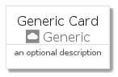
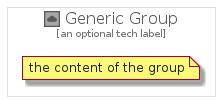

# Generic


```text
gcp/Item/Generic/Generic
```

```text
include('gcp/Item/Generic/Generic')
```


| Illustration | Generic | GenericCard | GenericGroup |
| :---: | :---: | :---: | :---: |
|  |  |  |  |


## Generic

### Load remotely
```plantuml
@startuml
' configures the library
!global $LIB_BASE_LOCATION="https://github.com/tmorin/plantuml-libs/distribution"

' loads the library's bootstrap
!include $LIB_BASE_LOCATION/bootstrap.puml

' loads the package bootstrap
include('gcp/bootstrap')

' loads the Item which embeds the element Generic
include('gcp/Item/Generic/Generic')

' renders the element
Generic('Generic', 'Generic', 'an optional tech label')
@enduml
```

### Load locally
```plantuml
@startuml
' configures the library
!global $INCLUSION_MODE="local"
!global $LIB_BASE_LOCATION="../../.."

' loads the library's bootstrap
!include $LIB_BASE_LOCATION/bootstrap.puml

' loads the package bootstrap
include('gcp/bootstrap')

' loads the Item which embeds the element Generic
include('gcp/Item/Generic/Generic')

' renders the element
Generic('Generic', 'Generic', 'an optional tech label')
@enduml
```

## GenericCard

### Load remotely
```plantuml
@startuml
' configures the library
!global $LIB_BASE_LOCATION="https://github.com/tmorin/plantuml-libs/distribution"

' loads the library's bootstrap
!include $LIB_BASE_LOCATION/bootstrap.puml

' loads the package bootstrap
include('gcp/bootstrap')

' loads the Item which embeds the element GenericCard
include('gcp/Item/Generic/Generic')

' renders the element
GenericCard('GenericCard', 'Generic Card', 'an optional description')
@enduml
```

### Load locally
```plantuml
@startuml
' configures the library
!global $INCLUSION_MODE="local"
!global $LIB_BASE_LOCATION="../../.."

' loads the library's bootstrap
!include $LIB_BASE_LOCATION/bootstrap.puml

' loads the package bootstrap
include('gcp/bootstrap')

' loads the Item which embeds the element GenericCard
include('gcp/Item/Generic/Generic')

' renders the element
GenericCard('GenericCard', 'Generic Card', 'an optional description')
@enduml
```

## GenericGroup

### Load remotely
```plantuml
@startuml
' configures the library
!global $LIB_BASE_LOCATION="https://github.com/tmorin/plantuml-libs/distribution"

' loads the library's bootstrap
!include $LIB_BASE_LOCATION/bootstrap.puml

' loads the package bootstrap
include('gcp/bootstrap')

' loads the Item which embeds the element GenericGroup
include('gcp/Item/Generic/Generic')

' renders the element
GenericGroup('GenericGroup', 'Generic Group', 'an optional tech label') {
    note as note
        the content of the group
    end note
}
@enduml
```

### Load locally
```plantuml
@startuml
' configures the library
!global $INCLUSION_MODE="local"
!global $LIB_BASE_LOCATION="../../.."

' loads the library's bootstrap
!include $LIB_BASE_LOCATION/bootstrap.puml

' loads the package bootstrap
include('gcp/bootstrap')

' loads the Item which embeds the element GenericGroup
include('gcp/Item/Generic/Generic')

' renders the element
GenericGroup('GenericGroup', 'Generic Group', 'an optional tech label') {
    note as note
        the content of the group
    end note
}
@enduml
```

