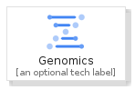
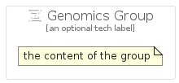

# Genomics


```text
gcp/Item/Genomics
```

```text
include('gcp/Item/Genomics')
```


| Illustration | Genomics | GenomicsCard | GenomicsGroup |
| :---: | :---: | :---: | :---: |
|  |  |  |  |


## Sprites
The item provides the following sriptes:

- `<$GenomicsXs>`
- `<$GenomicsSm>`
- `<$GenomicsMd>`
- `<$GenomicsLg>`


## Genomics

### Load remotely
```plantuml
@startuml
' configures the library
!global $LIB_BASE_LOCATION="https://raw.githubusercontent.com/tmorin/plantuml-libs/master/distribution"

' loads the library's bootstrap
!include $LIB_BASE_LOCATION/bootstrap.puml

' loads the package bootstrap
include('gcp/bootstrap')

' loads the Item which embeds the element Genomics
include('gcp/Item/Genomics')

' renders the element
Genomics('Genomics', 'Genomics', 'an optional tech label', 'an optional description')
@enduml
```

### Load locally
```plantuml
@startuml
' configures the library
!global $INCLUSION_MODE="local"
!global $LIB_BASE_LOCATION="../.."

' loads the library's bootstrap
!include $LIB_BASE_LOCATION/bootstrap.puml

' loads the package bootstrap
include('gcp/bootstrap')

' loads the Item which embeds the element Genomics
include('gcp/Item/Genomics')

' renders the element
Genomics('Genomics', 'Genomics', 'an optional tech label', 'an optional description')
@enduml
```

## GenomicsCard

### Load remotely
```plantuml
@startuml
' configures the library
!global $LIB_BASE_LOCATION="https://raw.githubusercontent.com/tmorin/plantuml-libs/master/distribution"

' loads the library's bootstrap
!include $LIB_BASE_LOCATION/bootstrap.puml

' loads the package bootstrap
include('gcp/bootstrap')

' loads the Item which embeds the element GenomicsCard
include('gcp/Item/Genomics')

' renders the element
GenomicsCard('GenomicsCard', 'Genomics Card', 'an optional description')
@enduml
```

### Load locally
```plantuml
@startuml
' configures the library
!global $INCLUSION_MODE="local"
!global $LIB_BASE_LOCATION="../.."

' loads the library's bootstrap
!include $LIB_BASE_LOCATION/bootstrap.puml

' loads the package bootstrap
include('gcp/bootstrap')

' loads the Item which embeds the element GenomicsCard
include('gcp/Item/Genomics')

' renders the element
GenomicsCard('GenomicsCard', 'Genomics Card', 'an optional description')
@enduml
```

## GenomicsGroup

### Load remotely
```plantuml
@startuml
' configures the library
!global $LIB_BASE_LOCATION="https://raw.githubusercontent.com/tmorin/plantuml-libs/master/distribution"

' loads the library's bootstrap
!include $LIB_BASE_LOCATION/bootstrap.puml

' loads the package bootstrap
include('gcp/bootstrap')

' loads the Item which embeds the element GenomicsGroup
include('gcp/Item/Genomics')

' renders the element
GenomicsGroup('GenomicsGroup', 'Genomics Group', 'an optional tech label') {
    note as note
        the content of the group
    end note
}
@enduml
```

### Load locally
```plantuml
@startuml
' configures the library
!global $INCLUSION_MODE="local"
!global $LIB_BASE_LOCATION="../.."

' loads the library's bootstrap
!include $LIB_BASE_LOCATION/bootstrap.puml

' loads the package bootstrap
include('gcp/bootstrap')

' loads the Item which embeds the element GenomicsGroup
include('gcp/Item/Genomics')

' renders the element
GenomicsGroup('GenomicsGroup', 'Genomics Group', 'an optional tech label') {
    note as note
        the content of the group
    end note
}
@enduml
```

