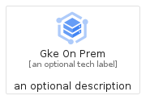
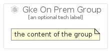

# GkeOnPrem


```text
gcp/Item/GkeOnPrem
```

```text
include('gcp/Item/GkeOnPrem')
```


| Illustration | GkeOnPrem | GkeOnPremCard | GkeOnPremGroup |
| :---: | :---: | :---: | :---: |
|  |  |  |  |


## GkeOnPrem

### Load remotely
```plantuml
@startuml
' configures the library
!global $LIB_BASE_LOCATION="https://raw.githubusercontent.com/tmorin/plantuml-libs/master/distribution"

' loads the library's bootstrap
!include $LIB_BASE_LOCATION/bootstrap.puml

' loads the package bootstrap
include('gcp/bootstrap')

' loads the Item which embeds the element GkeOnPrem
include('gcp/Item/GkeOnPrem')

' renders the element
GkeOnPrem('GkeOnPrem', 'Gke On Prem', 'an optional tech label')
@enduml
```

### Load locally
```plantuml
@startuml
' configures the library
!global $INCLUSION_MODE="local"
!global $LIB_BASE_LOCATION="../.."

' loads the library's bootstrap
!include $LIB_BASE_LOCATION/bootstrap.puml

' loads the package bootstrap
include('gcp/bootstrap')

' loads the Item which embeds the element GkeOnPrem
include('gcp/Item/GkeOnPrem')

' renders the element
GkeOnPrem('GkeOnPrem', 'Gke On Prem', 'an optional tech label')
@enduml
```

## GkeOnPremCard

### Load remotely
```plantuml
@startuml
' configures the library
!global $LIB_BASE_LOCATION="https://raw.githubusercontent.com/tmorin/plantuml-libs/master/distribution"

' loads the library's bootstrap
!include $LIB_BASE_LOCATION/bootstrap.puml

' loads the package bootstrap
include('gcp/bootstrap')

' loads the Item which embeds the element GkeOnPremCard
include('gcp/Item/GkeOnPrem')

' renders the element
GkeOnPremCard('GkeOnPremCard', 'Gke On Prem Card', 'an optional description')
@enduml
```

### Load locally
```plantuml
@startuml
' configures the library
!global $INCLUSION_MODE="local"
!global $LIB_BASE_LOCATION="../.."

' loads the library's bootstrap
!include $LIB_BASE_LOCATION/bootstrap.puml

' loads the package bootstrap
include('gcp/bootstrap')

' loads the Item which embeds the element GkeOnPremCard
include('gcp/Item/GkeOnPrem')

' renders the element
GkeOnPremCard('GkeOnPremCard', 'Gke On Prem Card', 'an optional description')
@enduml
```

## GkeOnPremGroup

### Load remotely
```plantuml
@startuml
' configures the library
!global $LIB_BASE_LOCATION="https://raw.githubusercontent.com/tmorin/plantuml-libs/master/distribution"

' loads the library's bootstrap
!include $LIB_BASE_LOCATION/bootstrap.puml

' loads the package bootstrap
include('gcp/bootstrap')

' loads the Item which embeds the element GkeOnPremGroup
include('gcp/Item/GkeOnPrem')

' renders the element
GkeOnPremGroup('GkeOnPremGroup', 'Gke On Prem Group', 'an optional tech label') {
    note as note
        the content of the group
    end note
}
@enduml
```

### Load locally
```plantuml
@startuml
' configures the library
!global $INCLUSION_MODE="local"
!global $LIB_BASE_LOCATION="../.."

' loads the library's bootstrap
!include $LIB_BASE_LOCATION/bootstrap.puml

' loads the package bootstrap
include('gcp/bootstrap')

' loads the Item which embeds the element GkeOnPremGroup
include('gcp/Item/GkeOnPrem')

' renders the element
GkeOnPremGroup('GkeOnPremGroup', 'Gke On Prem Group', 'an optional tech label') {
    note as note
        the content of the group
    end note
}
@enduml
```

