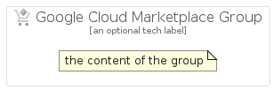

# GoogleCloudMarketplace


```text
gcp/Item/GoogleCloudMarketplace
```

```text
include('gcp/Item/GoogleCloudMarketplace')
```


| Illustration | GoogleCloudMarketplace | GoogleCloudMarketplaceCard | GoogleCloudMarketplaceGroup |
| :---: | :---: | :---: | :---: |
|  |  |  |  |


## GoogleCloudMarketplace

### Load remotely
```plantuml
@startuml
' configures the library
!global $LIB_BASE_LOCATION="https://raw.githubusercontent.com/tmorin/plantuml-libs/master/distribution"

' loads the library's bootstrap
!include $LIB_BASE_LOCATION/bootstrap.puml

' loads the package bootstrap
include('gcp/bootstrap')

' loads the Item which embeds the element GoogleCloudMarketplace
include('gcp/Item/GoogleCloudMarketplace')

' renders the element
GoogleCloudMarketplace('GoogleCloudMarketplace', 'Google Cloud Marketplace', 'an optional tech label')
@enduml
```

### Load locally
```plantuml
@startuml
' configures the library
!global $INCLUSION_MODE="local"
!global $LIB_BASE_LOCATION="../.."

' loads the library's bootstrap
!include $LIB_BASE_LOCATION/bootstrap.puml

' loads the package bootstrap
include('gcp/bootstrap')

' loads the Item which embeds the element GoogleCloudMarketplace
include('gcp/Item/GoogleCloudMarketplace')

' renders the element
GoogleCloudMarketplace('GoogleCloudMarketplace', 'Google Cloud Marketplace', 'an optional tech label')
@enduml
```

## GoogleCloudMarketplaceCard

### Load remotely
```plantuml
@startuml
' configures the library
!global $LIB_BASE_LOCATION="https://raw.githubusercontent.com/tmorin/plantuml-libs/master/distribution"

' loads the library's bootstrap
!include $LIB_BASE_LOCATION/bootstrap.puml

' loads the package bootstrap
include('gcp/bootstrap')

' loads the Item which embeds the element GoogleCloudMarketplaceCard
include('gcp/Item/GoogleCloudMarketplace')

' renders the element
GoogleCloudMarketplaceCard('GoogleCloudMarketplaceCard', 'Google Cloud Marketplace Card', 'an optional description')
@enduml
```

### Load locally
```plantuml
@startuml
' configures the library
!global $INCLUSION_MODE="local"
!global $LIB_BASE_LOCATION="../.."

' loads the library's bootstrap
!include $LIB_BASE_LOCATION/bootstrap.puml

' loads the package bootstrap
include('gcp/bootstrap')

' loads the Item which embeds the element GoogleCloudMarketplaceCard
include('gcp/Item/GoogleCloudMarketplace')

' renders the element
GoogleCloudMarketplaceCard('GoogleCloudMarketplaceCard', 'Google Cloud Marketplace Card', 'an optional description')
@enduml
```

## GoogleCloudMarketplaceGroup

### Load remotely
```plantuml
@startuml
' configures the library
!global $LIB_BASE_LOCATION="https://raw.githubusercontent.com/tmorin/plantuml-libs/master/distribution"

' loads the library's bootstrap
!include $LIB_BASE_LOCATION/bootstrap.puml

' loads the package bootstrap
include('gcp/bootstrap')

' loads the Item which embeds the element GoogleCloudMarketplaceGroup
include('gcp/Item/GoogleCloudMarketplace')

' renders the element
GoogleCloudMarketplaceGroup('GoogleCloudMarketplaceGroup', 'Google Cloud Marketplace Group', 'an optional tech label') {
    note as note
        the content of the group
    end note
}
@enduml
```

### Load locally
```plantuml
@startuml
' configures the library
!global $INCLUSION_MODE="local"
!global $LIB_BASE_LOCATION="../.."

' loads the library's bootstrap
!include $LIB_BASE_LOCATION/bootstrap.puml

' loads the package bootstrap
include('gcp/bootstrap')

' loads the Item which embeds the element GoogleCloudMarketplaceGroup
include('gcp/Item/GoogleCloudMarketplace')

' renders the element
GoogleCloudMarketplaceGroup('GoogleCloudMarketplaceGroup', 'Google Cloud Marketplace Group', 'an optional tech label') {
    note as note
        the content of the group
    end note
}
@enduml
```

