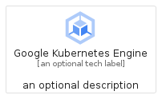
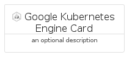

# GoogleKubernetesEngine


```text
gcp/Item/GoogleKubernetesEngine
```

```text
include('gcp/Item/GoogleKubernetesEngine')
```


| Illustration | GoogleKubernetesEngine | GoogleKubernetesEngineCard | GoogleKubernetesEngineGroup |
| :---: | :---: | :---: | :---: |
|  |  |  |  |


## Sprites
The item provides the following sriptes:

- `<$GoogleKubernetesEngineXs>`
- `<$GoogleKubernetesEngineSm>`
- `<$GoogleKubernetesEngineMd>`
- `<$GoogleKubernetesEngineLg>`


## GoogleKubernetesEngine

### Load remotely
```plantuml
@startuml
' configures the library
!global $LIB_BASE_LOCATION="https://raw.githubusercontent.com/tmorin/plantuml-libs/master/distribution"

' loads the library's bootstrap
!include $LIB_BASE_LOCATION/bootstrap.puml

' loads the package bootstrap
include('gcp/bootstrap')

' loads the Item which embeds the element GoogleKubernetesEngine
include('gcp/Item/GoogleKubernetesEngine')

' renders the element
GoogleKubernetesEngine('GoogleKubernetesEngine', 'Google Kubernetes Engine', 'an optional tech label', 'an optional description')
@enduml
```

### Load locally
```plantuml
@startuml
' configures the library
!global $INCLUSION_MODE="local"
!global $LIB_BASE_LOCATION="../.."

' loads the library's bootstrap
!include $LIB_BASE_LOCATION/bootstrap.puml

' loads the package bootstrap
include('gcp/bootstrap')

' loads the Item which embeds the element GoogleKubernetesEngine
include('gcp/Item/GoogleKubernetesEngine')

' renders the element
GoogleKubernetesEngine('GoogleKubernetesEngine', 'Google Kubernetes Engine', 'an optional tech label', 'an optional description')
@enduml
```

## GoogleKubernetesEngineCard

### Load remotely
```plantuml
@startuml
' configures the library
!global $LIB_BASE_LOCATION="https://raw.githubusercontent.com/tmorin/plantuml-libs/master/distribution"

' loads the library's bootstrap
!include $LIB_BASE_LOCATION/bootstrap.puml

' loads the package bootstrap
include('gcp/bootstrap')

' loads the Item which embeds the element GoogleKubernetesEngineCard
include('gcp/Item/GoogleKubernetesEngine')

' renders the element
GoogleKubernetesEngineCard('GoogleKubernetesEngineCard', 'Google Kubernetes Engine Card', 'an optional description')
@enduml
```

### Load locally
```plantuml
@startuml
' configures the library
!global $INCLUSION_MODE="local"
!global $LIB_BASE_LOCATION="../.."

' loads the library's bootstrap
!include $LIB_BASE_LOCATION/bootstrap.puml

' loads the package bootstrap
include('gcp/bootstrap')

' loads the Item which embeds the element GoogleKubernetesEngineCard
include('gcp/Item/GoogleKubernetesEngine')

' renders the element
GoogleKubernetesEngineCard('GoogleKubernetesEngineCard', 'Google Kubernetes Engine Card', 'an optional description')
@enduml
```

## GoogleKubernetesEngineGroup

### Load remotely
```plantuml
@startuml
' configures the library
!global $LIB_BASE_LOCATION="https://raw.githubusercontent.com/tmorin/plantuml-libs/master/distribution"

' loads the library's bootstrap
!include $LIB_BASE_LOCATION/bootstrap.puml

' loads the package bootstrap
include('gcp/bootstrap')

' loads the Item which embeds the element GoogleKubernetesEngineGroup
include('gcp/Item/GoogleKubernetesEngine')

' renders the element
GoogleKubernetesEngineGroup('GoogleKubernetesEngineGroup', 'Google Kubernetes Engine Group', 'an optional tech label') {
    note as note
        the content of the group
    end note
}
@enduml
```

### Load locally
```plantuml
@startuml
' configures the library
!global $INCLUSION_MODE="local"
!global $LIB_BASE_LOCATION="../.."

' loads the library's bootstrap
!include $LIB_BASE_LOCATION/bootstrap.puml

' loads the package bootstrap
include('gcp/bootstrap')

' loads the Item which embeds the element GoogleKubernetesEngineGroup
include('gcp/Item/GoogleKubernetesEngine')

' renders the element
GoogleKubernetesEngineGroup('GoogleKubernetesEngineGroup', 'Google Kubernetes Engine Group', 'an optional tech label') {
    note as note
        the content of the group
    end note
}
@enduml
```

