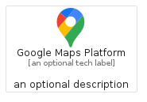
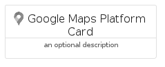
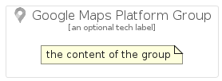

# GoogleMapsPlatform


```text
gcp/Item/GoogleMapsPlatform
```

```text
include('gcp/Item/GoogleMapsPlatform')
```


| Illustration | GoogleMapsPlatform | GoogleMapsPlatformCard | GoogleMapsPlatformGroup |
| :---: | :---: | :---: | :---: |
|  |  |  |  |


## GoogleMapsPlatform

### Load remotely
```plantuml
@startuml
' configures the library
!global $LIB_BASE_LOCATION="https://raw.githubusercontent.com/tmorin/plantuml-libs/master/distribution"

' loads the library's bootstrap
!include $LIB_BASE_LOCATION/bootstrap.puml

' loads the package bootstrap
include('gcp/bootstrap')

' loads the Item which embeds the element GoogleMapsPlatform
include('gcp/Item/GoogleMapsPlatform')

' renders the element
GoogleMapsPlatform('GoogleMapsPlatform', 'Google Maps Platform', 'an optional tech label', 'an optional description')
@enduml
```

### Load locally
```plantuml
@startuml
' configures the library
!global $INCLUSION_MODE="local"
!global $LIB_BASE_LOCATION="../.."

' loads the library's bootstrap
!include $LIB_BASE_LOCATION/bootstrap.puml

' loads the package bootstrap
include('gcp/bootstrap')

' loads the Item which embeds the element GoogleMapsPlatform
include('gcp/Item/GoogleMapsPlatform')

' renders the element
GoogleMapsPlatform('GoogleMapsPlatform', 'Google Maps Platform', 'an optional tech label', 'an optional description')
@enduml
```

## GoogleMapsPlatformCard

### Load remotely
```plantuml
@startuml
' configures the library
!global $LIB_BASE_LOCATION="https://raw.githubusercontent.com/tmorin/plantuml-libs/master/distribution"

' loads the library's bootstrap
!include $LIB_BASE_LOCATION/bootstrap.puml

' loads the package bootstrap
include('gcp/bootstrap')

' loads the Item which embeds the element GoogleMapsPlatformCard
include('gcp/Item/GoogleMapsPlatform')

' renders the element
GoogleMapsPlatformCard('GoogleMapsPlatformCard', 'Google Maps Platform Card', 'an optional description')
@enduml
```

### Load locally
```plantuml
@startuml
' configures the library
!global $INCLUSION_MODE="local"
!global $LIB_BASE_LOCATION="../.."

' loads the library's bootstrap
!include $LIB_BASE_LOCATION/bootstrap.puml

' loads the package bootstrap
include('gcp/bootstrap')

' loads the Item which embeds the element GoogleMapsPlatformCard
include('gcp/Item/GoogleMapsPlatform')

' renders the element
GoogleMapsPlatformCard('GoogleMapsPlatformCard', 'Google Maps Platform Card', 'an optional description')
@enduml
```

## GoogleMapsPlatformGroup

### Load remotely
```plantuml
@startuml
' configures the library
!global $LIB_BASE_LOCATION="https://raw.githubusercontent.com/tmorin/plantuml-libs/master/distribution"

' loads the library's bootstrap
!include $LIB_BASE_LOCATION/bootstrap.puml

' loads the package bootstrap
include('gcp/bootstrap')

' loads the Item which embeds the element GoogleMapsPlatformGroup
include('gcp/Item/GoogleMapsPlatform')

' renders the element
GoogleMapsPlatformGroup('GoogleMapsPlatformGroup', 'Google Maps Platform Group', 'an optional tech label') {
    note as note
        the content of the group
    end note
}
@enduml
```

### Load locally
```plantuml
@startuml
' configures the library
!global $INCLUSION_MODE="local"
!global $LIB_BASE_LOCATION="../.."

' loads the library's bootstrap
!include $LIB_BASE_LOCATION/bootstrap.puml

' loads the package bootstrap
include('gcp/bootstrap')

' loads the Item which embeds the element GoogleMapsPlatformGroup
include('gcp/Item/GoogleMapsPlatform')

' renders the element
GoogleMapsPlatformGroup('GoogleMapsPlatformGroup', 'Google Maps Platform Group', 'an optional tech label') {
    note as note
        the content of the group
    end note
}
@enduml
```

