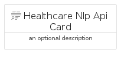
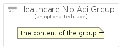

# HealthcareNlpApi


```text
gcp/Item/HealthcareNlpApi
```

```text
include('gcp/Item/HealthcareNlpApi')
```


| Illustration | HealthcareNlpApi | HealthcareNlpApiCard | HealthcareNlpApiGroup |
| :---: | :---: | :---: | :---: |
|  |  |  |  |


## HealthcareNlpApi

### Load remotely
```plantuml
@startuml
' configures the library
!global $LIB_BASE_LOCATION="https://raw.githubusercontent.com/tmorin/plantuml-libs/master/distribution"

' loads the library's bootstrap
!include $LIB_BASE_LOCATION/bootstrap.puml

' loads the package bootstrap
include('gcp/bootstrap')

' loads the Item which embeds the element HealthcareNlpApi
include('gcp/Item/HealthcareNlpApi')

' renders the element
HealthcareNlpApi('HealthcareNlpApi', 'Healthcare Nlp Api', 'an optional tech label', 'an optional description')
@enduml
```

### Load locally
```plantuml
@startuml
' configures the library
!global $INCLUSION_MODE="local"
!global $LIB_BASE_LOCATION="../.."

' loads the library's bootstrap
!include $LIB_BASE_LOCATION/bootstrap.puml

' loads the package bootstrap
include('gcp/bootstrap')

' loads the Item which embeds the element HealthcareNlpApi
include('gcp/Item/HealthcareNlpApi')

' renders the element
HealthcareNlpApi('HealthcareNlpApi', 'Healthcare Nlp Api', 'an optional tech label', 'an optional description')
@enduml
```

## HealthcareNlpApiCard

### Load remotely
```plantuml
@startuml
' configures the library
!global $LIB_BASE_LOCATION="https://raw.githubusercontent.com/tmorin/plantuml-libs/master/distribution"

' loads the library's bootstrap
!include $LIB_BASE_LOCATION/bootstrap.puml

' loads the package bootstrap
include('gcp/bootstrap')

' loads the Item which embeds the element HealthcareNlpApiCard
include('gcp/Item/HealthcareNlpApi')

' renders the element
HealthcareNlpApiCard('HealthcareNlpApiCard', 'Healthcare Nlp Api Card', 'an optional description')
@enduml
```

### Load locally
```plantuml
@startuml
' configures the library
!global $INCLUSION_MODE="local"
!global $LIB_BASE_LOCATION="../.."

' loads the library's bootstrap
!include $LIB_BASE_LOCATION/bootstrap.puml

' loads the package bootstrap
include('gcp/bootstrap')

' loads the Item which embeds the element HealthcareNlpApiCard
include('gcp/Item/HealthcareNlpApi')

' renders the element
HealthcareNlpApiCard('HealthcareNlpApiCard', 'Healthcare Nlp Api Card', 'an optional description')
@enduml
```

## HealthcareNlpApiGroup

### Load remotely
```plantuml
@startuml
' configures the library
!global $LIB_BASE_LOCATION="https://raw.githubusercontent.com/tmorin/plantuml-libs/master/distribution"

' loads the library's bootstrap
!include $LIB_BASE_LOCATION/bootstrap.puml

' loads the package bootstrap
include('gcp/bootstrap')

' loads the Item which embeds the element HealthcareNlpApiGroup
include('gcp/Item/HealthcareNlpApi')

' renders the element
HealthcareNlpApiGroup('HealthcareNlpApiGroup', 'Healthcare Nlp Api Group', 'an optional tech label') {
    note as note
        the content of the group
    end note
}
@enduml
```

### Load locally
```plantuml
@startuml
' configures the library
!global $INCLUSION_MODE="local"
!global $LIB_BASE_LOCATION="../.."

' loads the library's bootstrap
!include $LIB_BASE_LOCATION/bootstrap.puml

' loads the package bootstrap
include('gcp/bootstrap')

' loads the Item which embeds the element HealthcareNlpApiGroup
include('gcp/Item/HealthcareNlpApi')

' renders the element
HealthcareNlpApiGroup('HealthcareNlpApiGroup', 'Healthcare Nlp Api Group', 'an optional tech label') {
    note as note
        the content of the group
    end note
}
@enduml
```

