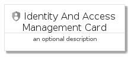
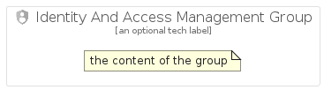

# IdentityAndAccessManagement


```text
gcp/Item/IdentityAndAccessManagement
```

```text
include('gcp/Item/IdentityAndAccessManagement')
```


| Illustration | IdentityAndAccessManagement | IdentityAndAccessManagementCard | IdentityAndAccessManagementGroup |
| :---: | :---: | :---: | :---: |
|  |  |  |  |


## IdentityAndAccessManagement

### Load remotely
```plantuml
@startuml
' configures the library
!global $LIB_BASE_LOCATION="https://raw.githubusercontent.com/tmorin/plantuml-libs/master/distribution"

' loads the library's bootstrap
!include $LIB_BASE_LOCATION/bootstrap.puml

' loads the package bootstrap
include('gcp/bootstrap')

' loads the Item which embeds the element IdentityAndAccessManagement
include('gcp/Item/IdentityAndAccessManagement')

' renders the element
IdentityAndAccessManagement('IdentityAndAccessManagement', 'Identity And Access Management', 'an optional tech label')
@enduml
```

### Load locally
```plantuml
@startuml
' configures the library
!global $INCLUSION_MODE="local"
!global $LIB_BASE_LOCATION="../.."

' loads the library's bootstrap
!include $LIB_BASE_LOCATION/bootstrap.puml

' loads the package bootstrap
include('gcp/bootstrap')

' loads the Item which embeds the element IdentityAndAccessManagement
include('gcp/Item/IdentityAndAccessManagement')

' renders the element
IdentityAndAccessManagement('IdentityAndAccessManagement', 'Identity And Access Management', 'an optional tech label')
@enduml
```

## IdentityAndAccessManagementCard

### Load remotely
```plantuml
@startuml
' configures the library
!global $LIB_BASE_LOCATION="https://raw.githubusercontent.com/tmorin/plantuml-libs/master/distribution"

' loads the library's bootstrap
!include $LIB_BASE_LOCATION/bootstrap.puml

' loads the package bootstrap
include('gcp/bootstrap')

' loads the Item which embeds the element IdentityAndAccessManagementCard
include('gcp/Item/IdentityAndAccessManagement')

' renders the element
IdentityAndAccessManagementCard('IdentityAndAccessManagementCard', 'Identity And Access Management Card', 'an optional description')
@enduml
```

### Load locally
```plantuml
@startuml
' configures the library
!global $INCLUSION_MODE="local"
!global $LIB_BASE_LOCATION="../.."

' loads the library's bootstrap
!include $LIB_BASE_LOCATION/bootstrap.puml

' loads the package bootstrap
include('gcp/bootstrap')

' loads the Item which embeds the element IdentityAndAccessManagementCard
include('gcp/Item/IdentityAndAccessManagement')

' renders the element
IdentityAndAccessManagementCard('IdentityAndAccessManagementCard', 'Identity And Access Management Card', 'an optional description')
@enduml
```

## IdentityAndAccessManagementGroup

### Load remotely
```plantuml
@startuml
' configures the library
!global $LIB_BASE_LOCATION="https://raw.githubusercontent.com/tmorin/plantuml-libs/master/distribution"

' loads the library's bootstrap
!include $LIB_BASE_LOCATION/bootstrap.puml

' loads the package bootstrap
include('gcp/bootstrap')

' loads the Item which embeds the element IdentityAndAccessManagementGroup
include('gcp/Item/IdentityAndAccessManagement')

' renders the element
IdentityAndAccessManagementGroup('IdentityAndAccessManagementGroup', 'Identity And Access Management Group', 'an optional tech label') {
    note as note
        the content of the group
    end note
}
@enduml
```

### Load locally
```plantuml
@startuml
' configures the library
!global $INCLUSION_MODE="local"
!global $LIB_BASE_LOCATION="../.."

' loads the library's bootstrap
!include $LIB_BASE_LOCATION/bootstrap.puml

' loads the package bootstrap
include('gcp/bootstrap')

' loads the Item which embeds the element IdentityAndAccessManagementGroup
include('gcp/Item/IdentityAndAccessManagement')

' renders the element
IdentityAndAccessManagementGroup('IdentityAndAccessManagementGroup', 'Identity And Access Management Group', 'an optional tech label') {
    note as note
        the content of the group
    end note
}
@enduml
```

